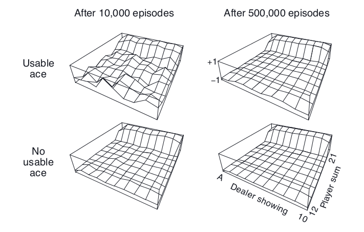
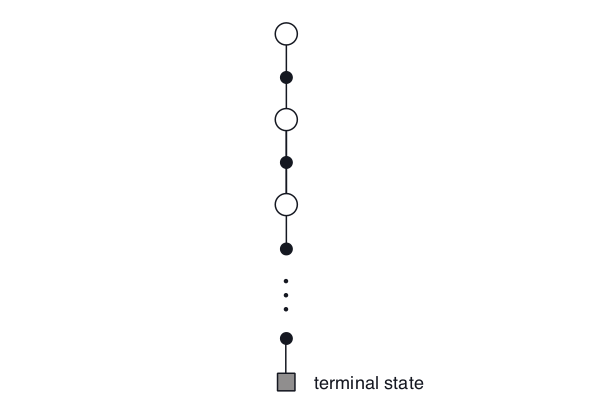

# 第五章  

# 蒙特卡洛方法

  这一章，我们开始考虑评估值函数以及获得最优策略的第一种学习方法。不同于上一章，这里我们不再假设我们对环境有完全的了解。蒙特卡洛方法(Monte Carlo methods)需要的仅仅是*经验(experience)*——与环境进行真实的或者模拟的交互所得到的状态，动作，奖励的样本序列。其中，从*真实*的经验学习是非常吸引人的，因为它在不需要关于环境动态的先验知识的情况下仍然能够获得最优的行为（策略）；而从*模拟*的经验学习也同样强大，虽然这时需要一个模型，但是这个模型仅仅用来产生样本，并不是动态规划(DP)方法中所用到的所有转移概率的完整分布函数。在相当多情况下我们很容易从目标的概率分布函数中进行抽样得到样本，可是很难获得这个分布的显式（具体）形式。[^译者注1]

​		

[^译者注1]: 这里是说，很多情况下我们不知道转移概率的具体分布，所以很难用动态规划的办法。但是我们很容易从与环境交互中获得抽样样本，可以用蒙特卡罗的办法。因为样本是直接从环境中获得的，等效于直接从真实的转移概率分布中抽样。

  蒙特卡罗方法是基于对样本回报(return)求平均的办法来解决强化学习的问题的。为了保证能够得到良好定义的回报，这里我们定义蒙特卡洛方法仅适用于回合制任务(eposodic tasks)。就是说，我们假设我们的经验(experience)被分成一个个的事件，而且对每个事件而言，不管选择什么样的动作，都会结束。只有在事件结束时，我们的价值估计和策略才会改变。蒙特卡洛方法因此能够写成逐个回合(episode)的增量形式。不过不能写成逐步（在线）的形式。术语“蒙特卡洛”被广泛的用于任何的在操作中引入了随机成分的估计方法。这里我们使用它来表示基于平均整个回报(return)的方法（区别于那些使用部分的回报(return)的方法。我们将在下一章阐述）。

  蒙特卡洛方法使用抽样以及对状态-动作对的*回报(return)*求平均的办法很像我们在第二章中遇到的赌博机中使用的方法，在第二章中我们也使用了抽样以及对每个动作的*奖励(reward)*求平均的方法。他们主要的区别在于，我们现在有多种状态，每个表现地就像一个不同的赌博机问题（就像一个联合-搜索或前后关联的赌博机），而且它们之间是相互关联的。就是说，在一个状态下做出一个动作的回报依赖于本事件中这个状态之后的状态所做的动作。因为所有动作的选择也正在学习中，从之前的表述来看，问题变成了非平稳(nonstationary)的。

  为了解决这种非平稳性(nonstationarity)，我们改变我们的办法，像我们在第四章中对动态规划方法(DP)所做的，使用广义策略迭代(general policy iteration, GPI)。那里我们依靠对MDP的了解来*计算(computed)*价值函数(value function)，这里呢我们从MDP的抽样回报中*学习(learn)*价值函数(value function)。我们使用相同的办法去获得最优的价值函数和策略，即GPI中价值函数和对应的策略交互作用。就像在动态规划(DP)的那章所做的，首先我们考虑yuce(prediction)的问题（计算一个随机策略$\pi$的价值$v_{\pi}$和$q_{\pi}$），然后是策略改进(policy improvment)，以及，最后，控制(control)的问题和解决它的办法广义策略迭代(general policy iteration, GPI)。从动态规划(DP)中得到的这些想法都被推广到蒙特卡洛(Monte Carlo)方法中。在这种情况下，我们只有样本经验(sample experience)。

---

## 5.1 蒙特卡洛预测

  我们开始考虑在给定策略的情况下，用蒙特卡罗方法学习状态-价值函数(state-value function)。我们之前讲过，一个状态(state)的价值(value)等于从这个状态开始，它的期望回报(expected return)——期望的累积未来折扣奖励(reward)。一个显而易见的估计方法是，对经验(experience)中的所有的这个状态的回报(return)求平均。随着更多的回报(return)被观察到，这个平均值会收敛于它的期望值，即期望回报(expected return)。这个想法根植于所有的蒙特卡洛方法(Monte Carlo methods)中。

  具体来看，假设我们想要估计$v_{\pi}({s})$的值。这个记号表示遵循策略$\pi$的情况下，状态$s$的价值。我们已经得到了一些回合(episodes)，它们都遵循策略$\pi$并且都出现了状态$s$。每当一个回合(episode)中出现状态$s$，我们就说这是对状态$s$的一次*访问(visit)*。当然了，在一个中状态$s$可能被访问(visit)多次。我们称第一次为*首次访问(first visit)*。所以呢我们有两种蒙特卡罗方法(Monte Carlo methods)，一种只计算所有回合中首次访问状态$s$的平均回报(return)，以此作为$v_\pi(s)$的估计值，我们称之为*first visit MC方法*；与之对应的，另一种方法计算所有回合中每次访问状态$s$的平均回报(return)，我们称之为*every visit MC方法*。上述的两种方法很相似，但是具有细微不同的理论特性。第一种方法（指 first-visit MC）被广泛研究可追溯到十九世纪四十年代，所以我们这一章主要关注这种方法。至于第二种方法呢，我们将在第九章和第十二章分别作为函数近似(function approximation)和资格迹(eligibility traces)的扩展。first visit MC方法如下所示。

> ---
>
> First-visit MC 策略估计（回报$$V \approx v_\pi$$）
>
> ---
>
> 初始化：
>
> ​	$\pi \leftarrow$ 需要估计的策略
>
> ​	$V \leftarrow$ 随机的价值状态函数
>
> ​	$Returns(s) \leftarrow$ 一个空的列表，对所有 $s \in S$ 
>
> 
>
> 一直循环：
>
> ​	使用$\pi$生成一个回合(episode)
>
> ​	对于回合中的每一个状态$s$：
>
> ​		$G \leftarrow$ $s$首次出现后的回报(return)
>
> ​		将$G$添加到列表$Returns(s)$中
>
> ​		$V(s) \leftarrow average(Returns(s))$
>
> `
>
> ---

  不论是first-visit MC方法还是every-visit MC方法，都会随着访问$s$的次数趋于无穷而收敛于$v_\pi(s)$。对于first-visit MC方法，这是显而易见的。在这种情况下，每个回报都是对于$$的有限方差的独立同分布的估计。根据大数定理，这些估计的平均数会收敛于期望价值(expectd value)。每个平均是无偏(unbiased)的估计，标准差随着次数减小的关系是$1 / \sqrt n$，其中$n$是求平均的量的个数（即是说，估计以二次方的速度收敛）。every-visit的方法则没有那么直观，不过也会二次方的速度收敛于$v_\pi(s)$(Singh and Sutton, 1996)。

  我们用一个例子来很好的说明如何使用蒙特卡洛方法(Monte Carlo method)。

---

**例5.1：二十一点(Blackjack)**	这个风靡于赌场的游戏*二十一点*是一种比谁手上的牌点数和大（不超过21点）的游戏。其中，所有的J，Q，K记为10点，A即可为1也可为11。我们考虑的版本是玩家独立面对庄家。游戏开始时每人手上有两张牌，其中庄家的牌有一张是明牌。如果玩家起手就是21点（一张10点的牌和一张A），这个叫*natural*。这种情况下就算庄家也是natural也判玩家赢，这种情况叫draw，游戏结束。如果玩家起手点数小于21点，那么他可以要牌(hits)，每次要一张，或者停止要牌(sticks)。如果玩家的牌超过21点，玩家就直接输了，叫做爆掉(goes bust)。如果玩家停止要牌，那么进入庄家回合，庄家的策略是，只要超过17点就停止，否则就一直要牌。如果庄家爆掉(bust)，那么玩家赢。如果大家都没爆掉，那么就比谁的点数接近21点。

  21点可以看成一个回合式的有限马尔科夫过程(episodic finite MDP)。每次游戏都是一个回合(episode)。赢、输、draw的奖励分别为1、-1、0。游戏过程中的任意动作奖励(reward)都为0，我们不算折扣（$\gamma = 1$）；因此这些结束状态的奖励(reward)即是回报(return)。玩家的动作(action)只有要牌(hits)或者停止要牌(sticks)两种。游戏的状态(state)取决于玩家是什么牌以及庄家手上的明牌。我们假设牌数是无限的，这样我们就不能记牌了。如果玩家将A当成11点来算的话（不能爆掉），我们称它*被使用了(usable)*。开始时我们把A当成11，因为如果当成1的话，那么开始时的牌肯定是小于等于11点的，这样我们没有更多的选择，肯定是会要牌(hit)的。所以，玩家做出的决定依赖于三个变量：当前的牌的点数和（12-21）、庄家的明牌的点数（A-10）以及玩家是否有被使用的A。这样的话，总共有200个不同的状态。

  我们考虑这样的策略：一直要牌，直到点数和等于20或21时停止。为了使用蒙特卡洛方法(Monte Carlo method)找到这个策略下的状态价值函数，我们使用一个模拟器模拟了许多次的游戏，游戏中玩家使用上述的策略。然后我们将每个状态的回报值求平均，作为对应状态的价值函数。注意这个任务中，first visit MC和every visit MC是一样的，因为一种状态只能在一个回合(episode)中出现一次。通过这种方法求得的价值函数如图5.1所示。可以看到，如果A被使用(usable)，相对于不被使用(no usable)，估计的值会有更多不确定性，更加不规则，因为这些状态不是很常见。经过500,000次的游戏，我们看到价值函数被估计得很好。

图5.1：遵循一直要牌直到点数和等于20或21的策略，使用蒙特卡洛策略估计求得的估计的状态价值函数。

  在这个任务中，虽然我们对环境有完全的了解，但是我们仍然难以用动态规划算法(DP)来计算价值函数。动态规划(DP)需要下一个状态的分布——具体讲，它需要转移函数$p(s^{'},r|s,a)$的值——而这在二十一点里不太好确定。例如说，假设玩家的牌面和为14点，并且玩家选择停止要牌(stick)。那么对应庄家的明牌点数，玩家的期望奖励(expected reward)是多少呢？所有这些期望奖励(expected reward)和转移函数$p(s^{'},r|s,a)$都需要在使用动态规划(DP)算法之前得知。而它们的计算量很大且容易出错。相比而言，使用蒙特卡洛方法(Monte Carlo method)仅仅只需要产生样本就好了，这要简单许多。上面所说的情况是非常常见的，蒙特卡洛方法(Monte Carlo method)只需要样本回合，这相比动态规划(DP)需要对动态环境有完全的了解而言有很大的优势。

---

  我们能将备份图表(backup diagrams)的想法推广到蒙特卡洛的算法中吗？这个图表的顶部根节点是我们需要更新的量，树枝和叶节点分别表示这些转移状态的奖励(reward)以及下个状态的估计价值。具体的，对于蒙特卡洛估计，如图5.2所示，根节点是我们的起始状态的价值，之后的轨迹表示一个特定回合的经历，最后以终止状态结束。我们可以通过与动态规划(DP)的图表(图3.4-左)对比发现，首先，动态规划(DP)的图表展示了所有的转移可能，列出了所有可能的下一状态，而蒙特卡洛(MC)在一个回合(episode)里只有一种转移可能。其次，动态规划(DP)只包含了一步的转移状态价值，而蒙特卡洛(MC)表示一个回合从开始到结束的所有状态价值。这些图表所表现的不同精确的反应了这两种算法的根本性的差异。

图5.2： 蒙特卡洛(MC)估计$v_\pi$的备份图表

​	

---

## 5.2 对动作价值的蒙特卡洛估计

---

## 5.3 蒙特卡洛控制

---

## 5.4 非初始探索的蒙特卡洛控制

---

## 5.5 通过重要性采样的离策略预测

---

## 5.6 增量式的实现

---

## 5.7 离策略控制

---

## *5.8 具体返回的重要性采样

---

## 5.9 小结

---

 

