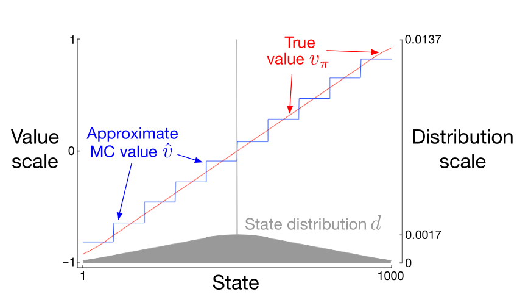

## 第9章

# 函数拟合与在策（On-policy）预测

​	本章，我们将开始探究如何在强化学习中用函数拟合（function approximation）从在策数据中估计状态值函数。即，从已知策略$\pi$产生的经验中去估计$v_\pi$。本章的亮点在于用于估值的值函数不再是一张表，而是由权重向量$\rm w \in\mathbb{R}^d$来表示的一个参数化的函数，记$\hat{v}(s,\rm w)\approx v_\pi(s)$为给定权重向量$\rm w$下状态$s$的估值。例如，$\hat{v}$可以是一个用特征向量$\rm w$来表示状态的线性函数。更一般地，$\hat{v}$可以是个由多个隐含层组成 的人工神经网络函数，其中$\rm w$就是各网络层的权重向量。通过调整权重，神经网络可模拟任意函数。又或者$\hat{v}$可以是个决策树函数，其中$\rm w$代表树中分节点和叶节点的值。一般来说权重的数量（$\rm w$的维度）会远小于状态总数（$d\ll|S|$），一个权重的改变会影响很多状态的估值。所以即使仅更新了一个状态，也会影响很多其他状态的估值。这种泛化特性增强了学习的潜力，也同时变得更加难以处理和理解。

​	也许让人惊喜的是使用函数拟合的强化学习也适用于部分可观测的任务，即智能体无法观测到一个状态的全部。若用以估算$\hat v$的参数化函数无法就状态的部分信息进行估值，那么这部分信息就是不可观测部分。事实上相对于完全可知的状态，本章所论述的所有函数拟合方法在部分可观测任务中理论上也有着同样好的表现。但是，函数拟合法也不是万能的，如利用该法基于过去的观测来增强状态的表征就是不可行的。在第$17.3$章我们将就该方向做扼要的延伸探讨。	

### 9.1 值函数(Value-function)估计

​	本书所言的所有预测方法都被描述为备份（backups）。换言之，备份就相当于更新---通过改变某状态的当前估值，使其趋向于该状态的”备份估值“（backed-up value）来完成状态函数的估值更新。记某个元素的备份为$s\to u$ ，其中$s$代表需备份的状态，而$u$代表备份后的估值，即$s$更新后的目标值。如，蒙特卡洛法中估值备份为$S_t\to G_t$，$\rm TD(0)$法中的备份为$S_t\to R_{t+1}+\gamma\hat v(S_{t+1},\rm w_t)$，而$n$步$\rm TD$备份法中的备份为$S_t\to G_{t:t+n}$。在$\rm DP$（动态规划/dynamic programming）中策略的估值备份则表示为$s\to \mathbb{E}_\pi[R_{t+1}+\gamma\hat v(S_{t+1},\rm w_t)|S_t=s]$，每一次会任选一个状态进行估值更能。不过在实际任务过程中$\rm DP$法备份的是当前任务中遇到的$S_t$。

​	自然地我们可将每次备份（backup）认为是利用估值函数针对每个状态的输入寻找（所期望的）输出的一种行为。 某种意义上，备份$s\to u$意味着$s$的估值应该趋向于$u$才对。 到目前为止，备份的实际执行还是很明了的：即在表格法中$s$的估值是在一定程度上向$u$的方向更新了一点，而其他的状态估值并没有发生变化。 而现在我们允许使用更繁杂的方法来执行备份这个操作。这类方法下对$s$的估值更新也会随之影响到其他状态的估值。 机器学习中用以学习模拟样本中输入-输出规律的方法被称之为“监督学习”。而当输出是数字（比如$u$）时，整个（模拟）过程往往被称为“函数拟合”（function approximation）。 函数拟合通过接收诸多具有期望行为（规律）的输入-输出样本来进行后续的估值。所以针对（强化学习中的状态）估值只要简单地将每次$s\to g$的更新作为训练样本传递给用以拟合的函数即可。如此我们便可将函数拟合后的值作为（新的）状态估值。

​	将每次更新视作典型的训练样本使得我们可以使用各种现存的函数拟合法来进行估值预测。基本上我们可以使用任何基于样本的监督学习方法，包括人工神经网络、决策树、以及多种多样的多变量回归（multivariate regression）。然而并非所有函数拟合法都能很好地适用于强化学习。最玄妙的神经网络和统计法都需要先假设有一个静态的训练集，即在该假设下默认是有多份样本被同时传入函数用以训练估值的。而在强化学习中则必须在和环境（或其模型）的交互中“在线地“学习。而要做到这点，需要确保学习方法能通过逐步获得的数据来高效地进行学习。此外，适用于强化学习的函数拟合法需要能处理非静态的目标函数（目标函数一直在变）。如在使用基于$\rm GPI$（generalized policy iteration）的控制方法时，我们往往需要在$\pi$变动的情况下学习$q_\pi$。即使策略不变，由bootstrapping法（$\rm DP$和$\rm TD$学习法）产生的训练样本目标值也是非静态的（译者：因样本的目标值本身就是基于部分的估值的）。因此无法有效处理非静态数据的方法就不适用于强化学习了。

### 9.2 预测指标（$\rm \overline {VE}$）

​	目前为止我们尚未明确指出用于预测的指标。若依然采用表格法，则我们并不需要不断地评估预测质量。因为习得的估值很可能就是真正的值函数，且学习到的状态估值是彼此分离的---即对任意状态的估值更新不会影响到影响到其他状态的估值。 而在真正的拟合法中对某状态的更新会影响到许多的状态，因此无法保证所有状态估值的绝对正确。一般我们假设任务中状态个数是大于权重个数的，因此某状态的估值越是精确，代表其他状态的估值误差会越大。那么在这种情况下我们不禁要问哪些状态才是我们更关心的呢？我们必须确定一个权重（weighting）或分布（distribution）$\mu (s)\geq 0,\sum_s\mu(s)=1$ ，来表示对各个状态$s$误差的关心程度。 这里指的误差（error）是估值$\hat v(s,\rm w)$和真值$v_\pi(s)$的差值平方。通过分布$\mu$在状态空间中对误差进行衡量，于是很自然地我们得到了一个目标函数---“均方误差”（ the Mean Squared Value Error)$\rm \overline {VE}$ ：

$$
\rm \overline {VE}(\rm w)\doteq \underset {s\in \mathbb{S}}\sum \mu(s)[v_\pi(s)-\hat v(s,\rm w)]^2. \tag{9.1}
$$
对其开方可得均方误差根---即$\rm \overline {VE}$的平方根，其给出了估值偏离真值程度的一个大概估计，且经常用于作图。关于$\mu (s)$的选择，一个典型的做法是取状态$s$（在某任务中）的时间占比。而若我们使用的是“在策” 则称其为“在策分布”（ on-policy distribution）；本章我们将着重并全面地分析该分布下的情况。另外在连续任务中在策分布是$\pi$下的静态分布。

> ---
>
> 回合制任务中的在策分布
>
> ---
>
> ​	在回合制任务中在策分布会略有不同，因其取决于每回合的初始状态。记$h(s)$为每回合开始于状态$s$的概率，同时记$\eta(s)$为平均每回合$s$所经历（experience）的总时步。所以在每回合中，无论其开始于状态$s$又或者从过去的某个状态$\bar s$转移到状态$s$，我们都说经历了状态$s$：
>
>
> $$
> \eta(s)=h(s)+\underset{\bar s}\sum \eta(\bar s)\underset{a}\sum \pi(a|\bar s)p(s|\bar{s},a), \forall s\in \mathbb{S}. \tag{9.2}
> $$
> 通过$\eta(s)$的期望值可以解决该方程，而通过正则化$\eta(s)$使之和为1则可得在策分布：
> $$
> d(s)={\eta(s)\over\sum_{s'}\eta(s')}.  \tag{9.3}
> $$
>
> 若不考虑折扣因子，这是个很自然的选择???

---

尽管持续性任务和回合制任务的行为类似，但在本书的这一部分，正如你将反复看到的那样---在函数拟合法的正式分析中我们将区别对待这两种情况。而这种（分类）也完善了我们的学习目标。

​	在强化学习中我们尚不完全清楚$\rm \overline {VE}$是否就是正确的性能衡量指标。但别忘了学习估值函数的宗旨是为了找到一个更好的策略。所以基于该目标最好的估值函数未必需要做到最小化的$\rm \overline {VE}$。然而在目前尚无更好选择的情况下，我们还是用$\rm \overline {VE}$作为性能指标吧。

​	基于$\rm \overline {VE}$，理想目标是找到一个“全局最优解”（global optimum），即对所有$\rm w^*$和$\rm w$，有$\rm \overline {VE}(\rm w^*)\leq \rm \overline {VE}(\rm w)$。对于一些简单的线性函数这个目标是可以做到的。但对于诸如人工神经网络和决策树这类复杂的函数模拟器则不太可能。这类复杂函数模拟器的缺点是---相较于全局最优，其最后可能会收敛至“局部最优”---即在$\rm w^*$的某个邻域，有$\rm \overline {VE}(\rm w^*)\leq \rm \overline {VE}(\rm w)$。尽管“局部最优”不是很让人放心，但对于非线性函数模拟器来说这往往已是最好且足够使用的结果了。但在许多有趣的强化学习案例中，我们依然无法保证收敛至最优（哪怕是最优解的某个邻域内）。 实际上某些强化学习的方法可能会造成$\rm \overline {VE}$发散---即在极限中$\rm \overline {VE}$趋向于无穷。

​	在前2节中我们给出了一个大致的框架，用以在诸多不同的强化学习任务中进行预测估值---具体来说，就是通过任务前期（对状态或Q值）的估值来构成样本用以对后期进行训练估值。 同时为了最小化（估值）偏差我们也引入了$\rm \overline {VE}$性能指标。 可用的函数拟合法实在太多了。且对于多数方法，我们并不清楚其是否可给出可靠的预测。因此出于必要性考虑，我们仅论述有限的几个方法。在本章后续部分我们将专注于基于梯度的函数拟合法，尤其是线性梯度下降法。 之所以重点讨论这类方法的一个原因是我们认为其很有前景（其揭示了关键原理）；另一个原因是鉴于篇幅有限，我们只能讨论这些简单的方法。

### 9.3 随机梯度法和半梯度法

​	在用以估值预测的学习方法中，现在我们开始深入探究其中一种---基于随机梯度下降（$\rm SGD$）的函数拟合方法。$\rm SGD$是最为广泛使用的函数拟合方法，且尤其适合在线的强化学习任务。

​	梯度下降法中的权重向量是一个由固定数量的元素$\rm w\doteq(\rm w_1,\rm w_2,...,\rm w_d)^T$[^1]组成的列向量，而估值函数$\hat v(s,\rm w)$是一个关于$s\in \mathbb{S}$的$\rm w$的可微函数。由于$\rm w$会在每个时步$t=0,1,2,3,...,$得到更新，所以我们需要定义$\rm w_t$以区分不同时步的$\rm w$。现在假设在每一时步我们会得到一个新的样本$S_t\to v_\pi(S_t)$，其包括（可能是随机选择的）状态$S_t$和其在该策略下的真值。在与环境互动中这些状态有可能是连续的，不过在此我们先不做该假设。可即便针对每一个$S_t$均有一个真值$v_\pi(S_t)$，我们仍然因数据有限而无法获得足够精度的函数器。函数拟合不是件简单的事情。尤其是在多数情况下，没有谁能保证$\rm w$能对所有状态甚至是所有样本做到绝对正确地估值。另外我们还需精心设计$\rm w$以应对没在（训练）样本中出现的状态。

​	假设所有样本中的状态均服从同一分布$\mu$，在该假设下我们试图最小化（9.1）中的$\rm \overline {VE}$。一个好主意是最小化那些已经观察到的样本的误差。“随机梯度下降法”（stochastic gradient-descent/SGD）在步过每一份样本后，通过将权重向量往能最小化该样本误差的方向挪动一小步来更新权重：
$$
\begin{eqnarray}
\rm w_{t+1}&\doteq&\rm w_t-{1\over2}\alpha\nabla[v_\pi(S_t)-\hat v(S_t,\rm w_t)]^2 \tag{9.4}\\
                         &=&\rm w_t+\alpha[v_\pi(S_t)-\hat v(S_t,\rm w_t)]\nabla\hat v(S_t,\rm w_t), \tag{9.5}
 \end{eqnarray}
$$

式中$\alpha$是个取正值的步长参数，而对于任意标量表达式$f(\rm w)$，$\nabla f(\rm w)$代表权重向量中各元素的偏导数组成的向量：
$$
\nabla f(\rm w)\doteq({\partial f(\rm w)\over\partial\rm w_1},{\partial f(\rm w)\over\partial\rm w_2},...,{\partial f(\rm w)\over\partial\rm w_d})))^T. \tag{9.6}
$$
该导数向量是$f$关于$\rm w$的梯度。$\rm SGD$之所以被称为“梯度下降”是因为在所有时步中，$\rm w_t$正比例于样本方差的负梯度（9.4）。在该方向下误差可以降低得最快。而称其为“随机”梯度法是由于仅有一个（可能是随机选择的）样本会被用来更新$\rm w$。$\rm w$每次都挪动一小步,那么在步过了大量样本后，最后就会达到最小化如$\rm \overline {VE}$这样的平均性能指标的效果。

​	我们可能无法理解为何每次$\rm SGD$仅往梯度方向挪动一小步？为何不直接往该方向更新全部的梯度以完全消除误差呢？原因是很多时候这样做虽然可行，但最终结果并非我们所期望的那样好。 务必记住我们并不需要一个误差为零的估值函数，而只需要该函数可以权衡所有不同状态的误差。若在某一时步中我们调整权重使其对该时步的状态估值保证绝对正确，则我们将无法找到（针对所有状态的）全局平衡。事实上，$\rm SGD$的最终收敛需要先假设有一个不断递减的$\alpha$。若$\alpha$如标准随机估计条件（2.7）那样递减，则(9.5)的$\rm SGD$法能够保证函数最终定收敛至局部最优。

[^1]: 符号$T$表示转置，在这里代表把一个行向量转置为列向量；本书中普遍采用列向量作为默认向量，除非显式地写成行向量或配以转置符号（比如本例）。

​	现在来看这样一个例子。该例中$U_t\in \mathbb R$作为第$t$个训练样本的目标输出$S_t \to U_t$，其并不是真值$v_\pi(S_t)$，而可能是真值的某个随机生成的模拟值。如，$U_t$可以是个有噪声的$v_\pi(S_t)$；又或者如前述章节提到的那样，是通过bootstrapping法提取而来的一个$\hat v$。在这种情况下因为$v_\pi(S_t)$是未知的，所以无法直接使用式（9.5）来更新梯度。但我们可以用$U_t$来代替$v_\pi(S_t)$---由此引申出了如下用于状态估值预测的一般$\rm SGD$方法：

$$
\rm w_{t+1}\doteq\rm w_t+\alpha[U_t-\hat v(S_t,\rm w_t)]\nabla \hat v(S_t,\rm w_t). \tag{9.7}
$$
若$U_t$是”无偏“估计，即对任意$t$若有$\mathbb E[U_t| S_t=s]=v_\pi(S_t)$，则在满足了式（2.7）针对一般随机拟合的条件下，一个递减的$\alpha$定能保证$\rm w_t$收敛至局部最优。

​	例如，若样本中的状态是基于策略$\pi$通过与环境（模拟）交互而产生的，则因状态的真值就是该状态的期望回报，根据对$v_{\pi}(S_t)$的无偏估计定义有蒙特卡洛目标$U_t\doteq G_t$。这种情况下一般$\rm SGD$方法（9.7）能对$v_\pi(S_t)$估值的收敛至局部最优。因此基于梯度下降的蒙特卡洛估值法是可以保证找到一个局部最优解的。相应的伪代码已展示在下图框中。

---

> 用蒙特卡洛梯度法估计$\hat v \approx v_\pi$
>
> ---
>
> 输入：用于评估的策略$\pi$
>
> 输入：一个可微函数$\hat v:\mathcal S \times \mathbb R^d\to\mathbb R$
>
> 对估值函数的权重$\rm w$做适当的初始化（例如 设 $\rm w=0$）
>
> 一直重复：
>
> ​	用$\pi$生成一个包含$S_0,A_0,R_1,S_1,A_1,...,R_T,S_T$的回合
>
> ​	对$t=0,1,...,T-1:$
>
> ​		$\rm w \leftarrow \rm w+\alpha[G_t-\hat v(S_t,\rm w)]\nabla\hat v(S_t,\rm w)$

---

​      注意，若目标$U_t$是由$v_\pi(S_t)$的bootstrapping估计而来的，则无法保证收敛。如$n$步$G_{t: t+n}$或者$\rm DP$目标中的$\sum_{a,s',r}\pi(a|S_t)p(s',r|S_t,a)[r+\gamma \hat v(s',\rm w_t)]$的Bootstrapping目标值均依赖当前的权重向量$\rm w_t$，其暗示了这种梯度下降是带有偏见的，所以基于这类目标值的梯度下降法并非一个真正意义的梯度下降法。 （对于该结论的）一个解释可以看式（9.4） 到（9.5）这一关键步骤转化，其需要保证目标值是独立于$\rm w_t$的。所以当用bootstrapping的估值代替了式中的$v_\pi(S_t)$时，这一步将不再有效。可见bootstrapping法实际上不是梯度下降的真正实例（Barnard,1993）。因这种方法虽然考虑了$\rm w_t$对估值部分的影响，却有意忽略了其对目标值的影响。所以此类方法只能算包含了部分梯度。鉴于此我们称其为半梯度法（ semi-gradient methods）。

​	虽然半梯度（bootstrapping）法无法像一般梯度法那样稳定收敛。但正如下节将讲述的那样，在使用诸如线性函数这类重要的估值函数的情况中其确实可保证收敛。而且这类方法也确实因某些优势而受到更多的青睐。优势一是这类方法往往学习得非常快（参考6、7章）。其二是它们可直接在线地并持续不断地学习（不用等到回合结束才开始学习）。而这个特性使得该方法适用于连续型问题并借此发挥了计算优势。一个使用半梯度法的范例是半梯度$\rm TD(0)$法，其目标值为$U_t\doteq R_{t+1}+\gamma\hat v(S_{t+1},\rm w)$。下页的方框中我们给出了该方法的完整伪代码。

---

> $用半梯度TD(0)法来估计\hat v\approx v_\pi$
>
> ---
>
> 输入：用于评估的策略$\pi$
>
> 输入：可微函数$\hat v:\mathcal S^{+}\times \mathbb R^{n}$，其中$\hat v(最终状态, . )=0$
>
> 初始化估值函数的权重$\rm w$,可取任意值（比如：$\rm w =0$）
>
> （每个回合）重复：
>
> ​	初始化$S$
>
> ​	（回合中的每个时步）重复：
>
> ​		选择$A\thicksim\pi(.|S)$
>
> ​		实施动作$A$，观察$R,S'$
>
> ​		$\rm w\leftarrow\rm w+\alpha[R+\gamma\hat v(S',\rm w)-\hat v(S,\rm w)]\nabla\hat v(S,\rm w)$
>
> ​		$S\leftarrow S'$
>
> ​	直到$S'$为终极状态		
>
> ---

​		“状态整合”是一般函数拟合法的一个简单形式。其将状态集进行分组，用一个值（权重向量$\rm w$中的一个元素）来表示每一组状态的估值。某一状态的估值就是其所属组别元素的值。当该状态值被更新时，仅代表该组的元素（相较于其他权重向量元素）会被更新。状态整合是$\rm SGD$ (9.7)的一个特殊情况，其中梯度$\nabla \hat v(S_t,\rm w_t)$为1代表状态$S_t$组的元素，为0代表其他组别的元素

**示例 9.1：从一个由1000个状态组成的随机步行任务中整合状态**。考虑一个有着1000个不同状态的随机步行任务（示例6.2和7.1（原书页码：P102、P118））。所有状态从左至右被标示为1~1000。所有回合的初始状态均位于中心点附近---即状态500。任务中智能体会从当前状态等概率地转移至其左右相邻的100个状态中的某一个状态。当然，若当前状态接近某侧边缘，则可转移至该侧的状态集可能会少于100个。这种情况下那些丢失的状态概率被转移到了该侧的终止状态（因此，状态1有0.5的概率在其左侧终止，而状态950有0.25的概率在其右侧终止）。按照惯例，我们设左侧终止状态的回馈为-1，而右侧的回馈为+1。其他所有状态的转移奖励为零。本示例将作为滚动示例反复出现在本节讨论中。

​	图9.1展示了该任务的真值函数$v_\pi$。可见其几乎是一条直线。并且其在水平方向上稍稍斜了一点，尤其在两侧的最后100个状态中弯曲得更加厉害。图中也显示了由$\alpha=2\times10^{-5}$的学习率结合状态整合的蒙特卡罗算法，在学习了100,000个回合得到的最终状态估值函数。关于状态整合，本例中是将1000个状态分成10组，每组100个状态（举例：状态1-100在组1，状态101-200在另一组，以此类推）。可见状态整合的一个典型结果就是图中所示的阶梯效果；其中每一分组中的估值都是恒等的，相邻组别的估值有很明显的落差。这些估值接近于$\rm \overline {VE}$（9.1）中的全局最小值。

​	$图 9.1：在1000状态随机步行任务中使用基于梯度蒙特卡洛法的函数拟合$

​	要观察估值的一些细节最好的做法是观察状态分布$\mu$（上图下半区域），其刻度在图右侧。正中央的状态500是回合的初始状态，且很难在回合中被再次访问到。平均来说1.37%的时步是在初始状态。而从初始状态走一步就能到达的状态是第二类最常被访问到的状态，可见有0.17%的时步是在这些状态中。之后所有的状态分布$\mu$近乎以线性的模式下降着，一直至最边缘处状态1和状态1000的0.0147%。这种分布最直观的效果就是图中最左侧分组中的状态估值明显要比无权重的平均真值要高一点；反之，右侧的状态估值相应的比平均真值要低一点。该现象是由于在$\mu$分布下这些组的状态权重有极大的不对称性。比如在最左侧组中，状态99的权重要比状态0高出3倍。因此相较于状态0，该组的估值会偏向于状态99的真值，可见其比状态0的真值要高。

#### 9.4 线性方法

​	在估值函数中最重要的函数之一就是估值函数$\hat v(.,\rm w)$是基于权重向量$\rm w$的线性函数。对任意$s$，存在实数向量$\rm x(s)\doteq(\rm x_1(s),\rm x_2(s),...,\rm x_d(s)^T$，其元素个数和$\rm w$相同。在线性法中状态的估值函数都是由$\rm w$和$\rm x(s)$的内积给出的：

$$
\hat v(s,\rm w)\doteq\rm w^T\rm x(s)\doteq  \sum_{i=1}^dw_i x_i(s) \tag{9.8}
$$
在该式中称估值函数和权重具有"线性相关性"，简单地说就是"线性相关"。

​	向量$\rm x(s)$是用以表示状态$\rm s$的“特征向量”。$\rm x(s)$中的每个元素$x_i(s)$都是函数$x_i:\mathcal S \to \mathbb R$的值。任一个这种函数在整体上被称为是一个”特征“，同时我们称关于状态$s$的函数值为状态$s$的”特征“。对于线性方法，特征就是基函数。因为它们构成了一组近似（状态估值的）函数的线性基础。构造一个$d$维的特征向量等同于选择$d$个基函数。而特征的定义方式多种多样，我们会在下一节给出一些选择。

​	自然地我们会想到在线性函数拟合中使用$\rm SGD$来更新梯度。该例中基于$\rm w$的估值函数的梯度是：

$$
\nabla\hat v(s,\rm w)=\rm x(s).
$$
因此在线性函数拟合中，一般$\rm SGD$更新公式（9.7）就简化为成了下面这种特殊形式了：
$$
\rm w_{t+1}\doteq\rm w_{t+1}+\alpha[U_t-\hat v(S_t,w_t)]\rm x(S_t)
$$
​	由于其足够简单，线性$\rm SGD$成了人们最喜欢用于数学分析的方法。对于各种学习系统而言，几乎所有有用的收敛结果都是针对线性（或更简单的）函数拟合法的。

​	特别地，在线性(函数)中只有一个最优解（或者在不理想的情况下，有一组同样好的最优解），所以这种情况下任何一种能保证收敛至（近似）局部最优的方法皆等同于收敛至（近似）全局最优。通常来说若学习率$\alpha$随时间递减的话，那么前面章节所述的蒙特卡罗算法的梯度就能通过线性函数拟合来收敛至$\overline {VE}$的全局最优解。

​	前节所述的半梯度$\rm TD(0)$法在线性函数拟合中也能保证收敛，但其收敛和普通$\rm SGD$的结果不同；关于这点需要用另一个定理来说明。此外，该方法下最终收敛的权重向量也不是全局最优，而是一个靠近局部最优的解。该方法在持续性任务中显得尤为重要，因而有很多细节需要深入思考。如每个时刻$t$的更新可表示为：

$$
\begin{eqnarray}
\rm w_{t+1}&\doteq&\rm w_t+\alpha(R_{t+1}+\gamma\rm w^T_t\rm x_{t+1}-\rm w^T_t\rm x_t)\rm x_t \tag{9.9}\\
&=&\rm w_t+\alpha(R_{t+1}\rm x_t-\rm x_t(\rm x_t-\gamma\rm x_{t+1})^T\rm w_t),
\end{eqnarray}
$$
其中我们使用符号简写来表示$\rm x_t=x(S_t)$。当该系统达到稳定状态后，对于任意给定$\rm w_t$，下一次更新的期望权重向量可写为：

$$
\mathbb E[\rm w_{t+1}|\rm w_t]=\rm w_t+\alpha(b-A\rm w_t),  \tag{9.10}
$$
其中 

$$
b\doteq\mathbb E[R_{t+1}\rm x_t] \in \mathbb R^d ， A\doteq\mathbb E[\rm x_t(\rm x_t-\gamma\rm x_{t+1})^T] \in \mathbb R^n \times \mathbb R^n \tag{9.11}
$$
若该系统是收敛的，则从式（9.10）可见其一定收敛于权重向量$\rm w_{TD}$，其中：

$$
\begin{eqnarray}
b-A\rm w_{TD}&=&0\\
\Rightarrow \qquad\qquad\qquad  b&=&A\rm w_{TD}\\
\Rightarrow\qquad\qquad\,\,\,\,\, \rm w_{TD}&\doteq&A^{-1}b.\tag{9.12}
\end{eqnarray}
$$
该量（quantity）被称作”$TD$固定点“（ TD fixpoint）。事实上线性半梯度$\rm TD(0)$法收敛于该点。有些理论可证明其收敛性。而下图框中给出了上式中逆矩阵(inverse?)的存在证明。

> ---
>
> 线性$\rm TD(0)$方法的可收敛性证明
>
> ---
>
> 怎样的属性才能保证线性$\rm TD(0)$算法（9.9）的证明呢？我们先将式（9.10）重写为如下形式以获得些灵感：
> $$
> \Bbb E[\rm w_{t+1}|\rm w_t]=(\rm I-\alpha A)\rm w_t+\alpha b.\tag{9.13}
> $$
> 注意，矩阵$\rm A$是和权重向量而不是$\rm b$相乘的；因此只有$\rm A$对收敛有影响。为了便于理解，考虑$\rm A$为对角矩阵的特殊情况。若所有的对角元素为负，则其相应的的矩阵元素$\rm I-\alpha A$会比一大，随之相应的$\rm w_t$元素会被放大。如果照这样更新下去，最终会导致结果发散。另一方面，若$A$的所有对角元素均为正，则$\alpha$可选择一个比 $1/X$更小的值(译者：$X$为$A$对角元素中的最大值)。如此$\rm I-\alpha A$也成为了一个由所有介于0~1间的对角元素组成的对角矩阵。 在该情况下式中第一项会趋向于压缩$\rm w_t$，如此便保证了结果的稳定性。一般当A是正定矩阵---即对所有实向量$y$有$y^{\sf T} Ay>0$时，$\rm w_t$会被压缩至$\rm 0$。而正定性同样保证了逆矩阵$A^{-1}$的存在。
>
> ​	对于线性$\rm TD(0)$，在$\gamma<1$的持续性任务中，矩阵$A$(9.11)可写为：
> $$
> \begin{eqnarray}
> A&=&\sum_s\mu(s)\sum_a\pi(a|s)\sum_{r,s'}p(r,s'|s,a)\rm x(s)(\rm x(s)-\gamma\rm x(s'))^\sf T\\&=&\sum_s \mu(s)\sum_s'p(s'|s)\rm x(s)(\rm x(s)-\gamma\rm x(s'))^\sf T\\&=&\sum_s\mu(s)\rm x(s)\left(\rm x(s)-\gamma\sum_s'p(s'|s)\rm x(s')\right) ^\sf T\\&=&\rm X^\sf T\rm D(\rm I-\gamma P)\rm X,
> \end{eqnarray}
> $$
> $\mu (s)​$代表策略$\pi​$下的静态（stationary）分布，$p(s'|s)​$是从$s​$到$s'​$的转移概率，$\rm P​$是这些概率的$|\sf S|​$行$|\sf S|​$列矩阵，$\mu​$是以$\mu(s)​$ 为对角项所组成的$|\sf S|​$行$|\sf S|​$列的对角矩阵。而$\rm X ​$是$|\rm S|​$行$d​$列的矩阵，其中$\rm x(s)​$是其行（向量）。从这里能很清楚地看到$\rm A​$是否正定关键在于矩阵$\mu(\rm I-\gamma P)​$。
>
> ​	（dbsx）诸如此类的关键矩阵，只要在其各列之和为非负数情况下放可保证正定性。这是由Sutton (1988, p. 27)基于上述（previously）2条定理而提出的。定理1：对任意矩阵	$\rm M$,当且仅当其对称矩阵$\rm S=\rm M+\rm M^\sf T$是正定的，则$\rm M$为正定矩阵。定理2：对任意对称实矩阵$\rm S$,若其对角元素值均为正，且（任意一个对角元素）值比其相应的非对角元素之和大(Varga 1962, p. 23)，则$\rm S$为正定矩阵（译者：本句翻译有待斟酌）。这里我们的关键矩阵$\mu(\rm I-\gamma P)$，其对角元素为正，其他元素为负。所以只要证明每行之和加上对应的每列之和为正即可。因为$\rm P$是随机矩阵且$\gamma <1$所以行之和一定为正。那么现在仅需证明列之和为非负即可。注意，对于任意矩阵$\rm M$,由其列之和构成的行向量均可写成$1^\sf T\rm M$,其中$\rm 1$是元素均为1的列向量。记$\mu$为基于分布$\mu(s)$的$|\sf S|$向量。因为$\mu$是静态分布，所以$\mu=\rm P^\sf T\mu $。 那么现在我们的关键矩阵的列之和可表述为：
> $$
> \begin{eqnarray}
> \rm 1^\sf T\mu(\rm I-\gamma\rm P)&=&\mu^\sf T(\rm I -\gamma \rm P)\\&=&\mu^\sf T-\gamma \mu^\sf T\rm P\\&=&\mu^\sf T-\gamma\mu^\sf T  \qquad（因为\mu是静态分布）\\&=&(1-\gamma)\mu,
> \end{eqnarray}
> $$
> 可见该关键矩阵的所有元素均为正。因此该矩阵及其$A$矩阵均为正定矩阵，因而在策略TD(0)法也是稳定的。（若要证明其收敛概率为1，需额外增加一个随时间递减的$\alpha$作为辅助条件。）

---

​	而在$\rm TD$固定点，也已证明其$\rm \overline {VE}$（在持续的情况下）的波动仅限于最小可能误差的某个有限范围内：

$$
\rm\overline {VE}(\rm w_{TD})\leq{1\over1-\gamma}\min_w\overline{VE}(\rm w).\tag{9.14}
$$
也就是说，$\rm TD$法的近似误差（ asymptotic error）不会大于$1\over1-\gamma$乘以最小可能误差的值。这个最小可能误差在蒙特卡罗法的极限中可获得。由于$\gamma$往往近似于1，该膨胀因子会很大。因此$\rm TD$法的渐近性能会有一定的潜在损失。另外正如我们在第6,7章看到的那样---相较于蒙特卡罗法，由于$\rm TD$法的估值方差更低，所以其学习得更快。因而具体该用哪种方法取决于问题和相应函数拟合方法的特征以及学习所需的时间。

​	（9.14）的约束也适用于一些其他在策bootstrapping法。例如基于在策分布的线性半梯度$\rm DP$法（如：式9.7，其中$U_t\doteq\sum_a\pi(a|S_t)\sum_{s',r}p(s',r|S_t,a)[r+\gamma\hat v(s',\rm w_t)]$）也会收敛至$\rm TD$固定点。而在单步半梯度“操作值“（action-value）类方法中，诸如下章提到的半梯度$\rm Sarsa(0)$法，它们也有个类似的$\rm TD$固定点和约束。回合制任务中也有个类似的约束（详见 Bertsekas 和 Tsitsiklis, 1996）。为了满足约束，需要回馈、特征及步长参数的递减满足一定的条件，在此我们不做深入展开。欲知详情请参考原论文（Tsitsiklis 和 Van Roy, 1997）。

​	保证这些收敛结果的关键在于状态的更新是服从在策分布的。对于其他状态分布，如使用了函数拟合的bootstrapping法可能会导致结果发散至无穷。我们将在第$\rm 11$章论讨论关于该情况的示例和解决方案。

**示例 9.2：在1000-状态随机步行中使用bootstrapping法**  状态聚合是使用线性函数拟合法的一种特殊情况。那么结合本章的内容，我们来看下在1000-状态随机步行任务中能有哪些发现。 图9.2的左图展示了经由状态聚合（例9.1）的半梯度$\rm TD(0)$法（p197）学习而来的最终状态值函数。可见$\rm TD$法的估值误差远大于蒙特卡罗法（图9.1）。

​	然而$\rm TD$法在学习效率上有着很大的潜在优势。正如第7章所述，其将纯蒙特卡罗法推广至多步$\rm TD$法。在该步行任务中，从图9.2的右图可见，使用了状态聚合的半梯度$\rm TD$法和之前在19-状态随机步行任务中的表格法在结果上有着惊人的相似。这里为了保证数量上的相似性，我们将状态聚合改为20分组，每组50个状态。因为20个分组在数量上近似于表格法中的19个状态。特别地，使用状态聚合的状态分组的组状态转移概率（指转移到相邻的分组状态，平均每50，或最多100个状态为一组）也和使用表格法的单状态转移概率类似。为了类比，这里我们使用和表格法任务中同样的$\rm RMS$误差指标来衡量前10个回合中所有状态的表现（不用$\rm \overline {VE}$是因为其更适合于使用函数拟合的任务）。

$图 9.2：在1000-状态随机步行任务中使用状态聚合的bootstrapping法。\\左图: 相较于图 9.1中的\rm MC估值,半梯度\rm TD的渐近估值要糟糕一些。\\右图：结合状态聚使用了n步\rm TD法和图7.2的表格法中的结果有着惊人的相似性。$

​	将第7章所述的$n$步$\rm TD$算法融入半梯度函数拟合后就自然成为了我们在示例中所用的半梯度$n$步$\rm TD$法了。类似于（7.2），关键函数是：
$$
\rm w_{t+n}\doteq\rm w_{t+n-1}+\alpha\left[G_{t:t+n}-\hat v(s_t,\rm w_{t+n-1}) \right]\nabla\hat v(S_t,\rm w_{t+n-1}),\,0\leq t<T,\tag{9.15}
$$
其中的$n$步回报是从（7.1）式推广而来的：
$$
G_{t:t+n}\doteq R_{t+1}+\gamma R_{t+2}+...+\gamma^{n-1}R_{t+n}+\gamma^n\hat v(S_{t+n,\rm w_{t+n-1}}),0\leq  t<T-n,\tag{9.16}\\
$$
下面给出了该算法的完整伪代码。

> ---
>
> 用$n$步半梯度$\rm TD$法估计$\hat v\approx v_\pi$
>
> ---
>
> 输入：用于评估的策略$\pi$
>
> 输入：可微函数$\hat v:\mathcal S^{+}\times \mathbb R^{n}$，其中$\hat v(最终状态, . )=0$
>
> 参数：学习率 $\alpha\in(0,1]$，一个正整数$n$
>
> 可访问所有已存储的操作符($S_t$和$R_t$)的下标来和n做模运算
>
> 任意初始化估值函数的权重$\rm w$ (比如：$\rm w=0$)
>
> （每个回合）重复：
>
> ​	初始化并储存$S_0\neq \rm terminal$
>
> ​	$T \leftarrow \infty$
>
> ​	当$t=0,1,2,...:$
>
> ​	|	若$t<T$，则：
>
> ​	|		根据$\pi(.|S_t)$选择一个动作
>
> ​	|		观察并储存下一个回馈$R_{t+1}$和下一个状态$S_{t+1}$
>
> ​	|		若$S_{t+1}$是终点，则$T\leftarrow t+1$
>
> ​	|	$\tau \leftarrow t-n+1\quad$ （$\tau$所在的状态估值将被更新）
>
> ​	|	若$\tau\geq0:$
>
> ​	|		$G\leftarrow \sum^{min(\tau+n,T)}_{i=\tau+1}\gamma^{i-\tau-1}R$
>
> ​	|		若$\tau+n< T$，则$G\leftarrow G+\gamma^n\hat v(S_{\tau+n},\rm w)\qquad	 (G_{\tau:\tau+n})$
>
> ​	|		$\rm w\leftarrow\rm w+\alpha[G-\hat v(S_\tau,\rm w)]\nabla\hat v(S_\tau,\rm w)$
>
> ​	直到$\tau=T-1$	
>
> ---

​	

​	

### 9.5 线性(拟合)法中的特征构造

​	线性法的有趣之处不仅在于其可收敛性，也在于实践中其能高效的处理数据和计算。是否真的能如此高效的关键在于任务状态是如何被特征表示的，而这也是本大节我们需深入研究的。选择合适的特征是给强化学习系统增加先验知识的一个重要途径。直觉上，选择的特征应该能反映任务状态空间的某些方面，带有这些属性的特征也意味着其有最好的泛化能力。例如，若我们在评估一个几何物体，则可以选择的特征有几何体的形状、颜色、尺寸和功能。如果我们评估的是移动机器人的状态，则我们需要的特征可能包括（机器人的）位置，剩余电量，最近的声纳数据等等。

​	线性法的一个缺陷是其没有考虑各个特征间的交互影响---某个特征$i$只有当另个特征$j$不存在时才有效。如在平衡木任务（示例3.4）中，一个高角速度是好是坏取决于当前的角度。若角度高，则高角速度意味着危险---因木棒即将坠落，所以是个坏状态。然而若角度低，则高角速度意味着木棒正在纠正自己的位置---所以是个好状态。在线性估值中若没有整合角速度和角度这2个特征的话，则其估值函数无法很好地表示该任务的状态。在接下来的小节里我们将讨论各种整合特征的方法。

#### 9.5.1 多项式

​	许多问题的状态都会被初始化为数字。如平衡木中位置和速度（示例3.4），在Jack租车问题中每个车库的停车数（示例4.2）及赌徒问题中赌徒的资金（示例4.3）。可见在这些任务中，用于强化学习的函数拟合和内插回归问题有着诸多相似之处。很多普遍用于求解内插回归的特征也可以用于强化学习任务。在内插回归问题中，多项式特征给出了一种最简单的特征表示方法。但在强化学习中，我们发现最基本的多项式特征并不比其他特征好。但由于易于理解性和与其他特征构造法的相似性，这里将其用作抛砖引玉是再合适不过了。

​	假设现在有个强化学习问题，其状态需要用2个维度的特征来表示。对于某个状态$s$，我们设2个特征为$s_1\in\mathbb R$和$s_2\in\mathbb R$。则用该2个维度的状态特征可表示为$\rm x(s)=(s_1,s_2)^\sf T$。这里有2个局限---1.无法体现2个维度特征的交互影响；2.当2个特征都为零时，最后的估值也会是零。为了克服这种局限性，可用如$(1,s_1,s_2,s_1s_2)^{\sf T}$这种4维特征。第一个特征$1$使得可以使用初始状态值来表示仿射函数；而最后的乘积特征$s_1s_2$则包含了特征间的交互影响。当然为了表征更复杂的交互影响，你也可以引入更复杂的特征组合，如$(1,s_1,s_2,s_1s_2,s^2_1,s^2_2,s_1s^2_2,s^2_1s_2,s^2_1s^2_2)^{\sf T}$。使用这些组合特征使得函数以多元二次的形式进行拟合----尽管由那些需要被学习的权重组成的拟合函数依然是线性的。这里通过将特征从二维拓展至$k$维使得我们可以对某问题的状态维度给出高度复杂的特征间交互影响的表征：

​	

> ---
>
> ​	假设一个状态$s$对应$k$个数字，$s_1,s_2,...,s_k$,其中$s_i \in \mathbb R$。则对于$k$维状态空间，每个基于多项式的$n$阶特征$x_i$可写作：
>
> $\rm x_i(s)=\prod^k_{j=1}s^{c_i,j}_j,\tag{9.17}$
>
> 其中$c_{i,j}$属于集合$\{0,1,...,n\}$（$n$是一个整数，且$n≥0$）。通过这种方式我们构造了一个基于$n$阶多项式的$k$维特征，其包含了$(n+1)^k$个不同的特征。
>
> >---

​	高阶多项式允许对更复杂的函数进行更精准的拟合。但因基于$n$阶多项式的$k$维特征数$(n＞0)$成指数级增长，所以一般有必要筛选一个子状态集用以函数拟合。该过程可通过借助先验知识（belief）观察被拟合的函数本质来加以实施。而另一些在多项式回归中发展而来的自动选取特征的方法则可适用于处理具有具有递增、非静态属性的强化学习任务。

**测验9.1**  为何式（9.17）要为$k$维状态空间定义$(n+1)^k$个不同的函数？

**测验9.2** 给出用以产生特征向量$(1,s_1,s_2,s_1s_2,s^2_1,s^2_2,s_1s^2_2,s^2_1s_2,s^2_1s^2_2)^{\sf T}$的基函数定义元素---$n$和$c_{i,j}$。

#### 9.5.2 傅里叶基

​	另一种线性函数拟合是基于时间的傅里叶级数（Fourier series）。其告诉我们任意一个周期函数均可表示成以三角函数$sine$或者$cosine$为基函数(特征)的不同级别的加权和。（若对所有$x$及部分周期$\tau$有$f(x)=f(x+\tau)$，则$f$是以$\tau$为周期的函数）傅里叶级数和更一般的傅里叶变换被广泛地用于应用科学。因为若被拟合函数是已知的，则往往其基函数的权重项可以（are 代表一定？）用简单的形式表示。而且只要有足够多的基函数，任何函数皆可被精确地估计。有意思的是，尽管在强化学习任务中被拟合的函数是未知的，但傅里叶基函数依然在很多任务中有着不错的表现。~~Konidaris, Osentoski, 和Thomas 在2011年展示了一个由简单的傅里叶基构造的函数可以被用于多个由多维持续性状态空间构成的强化学习问题，且该函数并不需要具有周期性。~~

​	首先考虑下单维度的情况。由一般傅里叶级数构成的一维函数有一个周期$\tau$，通过该周期将估值函数表示为正余弦函数的线性组合，而其中每个正余弦函数的周期可被$\tau$整除（即其周期可由一个整数乘以某个基准周期$1/\tau$来表示）。不过若被拟合的是个定义在有界区间的非周期函数，则可以将傅里叶基函数的周期$\tau$设为该区间的长度。可见这类由正余弦基函数构造的线性组合的特别之处在于其仅含有一个周期。

​	且（在该例中）若将周期设为目标区间的2倍，并仅关心半个周期区间$[0,\tau/2]$中的估值的话，则仅用余弦基函数即可---因为任意“偶”函数均可由余弦基函数表示，即仅用余弦基函数可表示任意轴对称函数。所以只要有足够多的余弦基函数，在半周期$[0,\tau/2]$区间的任意函数均可被近似估计到指定精度。（这里的“任意函数”并不严谨，因严格来说必须保证函数是 mathematically well-behaved的。这里我们忽略之。）另外，也可仅用正弦基来构造（特征的）线性组合，其结果一定是奇（关于原点中心对称的）函数。不过一般还是用余弦基函数更好。因为后者往往在原点（origin）处不连续，所以“半偶”函数比“半奇”函数更容易模拟。当然，据此并不能排除在$[0,\tau/2]$同时使用正余弦基函数的有效性，但某些时候这种方法会有一定风险。

​	遵循该逻辑我们设$\tau=2$,于是得特征的定义域为$\tau$的一半$[0,1]$,那么由$n+1$个特征组成的单维$n$阶傅里叶余弦基函数就是：
$$
x_i(s)=cos(i\pi s), s \in[0,1],
$$
其中$i=0,...,n$。图9.3展示了单维傅里叶余弦基函数$x_i$（其中$i=1,2,3,4$，$ x_0$为常数函）。~~与多项式基函数不同的是傅里叶基函数总是有界的，不需要求幂（do not require exponentiation）。~~

$图9.3：通过一维傅里叶余弦基构造的特征x_i=1,2,3,4来拟合在区间[0,1]间的函数。\\资料来自\rm Konidaris等人（2011）。$

​	在多维的情况下傅里叶余弦级数也有该性质。详解如下：

> ---
>
> 假设每个状态$s$由$k$个数字组成的向量$s=(s_1,...,s_k)^{\sf T},s_i \in [0,1]$构成，则$n$阶傅里叶余弦基函数中的第$i$个特征可写为：
> $$
> x_i(s)=cos(\pi s^{\sf T}c^i), \tag{9.18}
> $$
> 其中$c^i=(c^i_1,...,c^i_k)^{\sf T}$，且对$j=1,...,k;i=0,...,(n+1)^k$有$c^i_j\in \{0,...,n\}$。该式为$(n+1)^k$个整数向量中的每个向量$c^i$定义了一个特征。内积$s^{\sf T}c^i$的作用是将整数$\{0,...,n\}$赋给$s$的每个维度。在一维情况下，该整数决定了在那个维度下特征的使用频率。当然针对特定任务，我们也可以调整特征以适应该任务下的有界状态空间。

------

​	作为一个示例，考虑$k=2$的情况，则$s=(s_i,s_2)$，且每个$c^i=(c^i_1,c^i_2)^\sf T$。图9.4展示了基于6个傅里叶余弦基函数的情况，其中每张图由向量$c^i$定义（$s_1$代表纵轴而$c^i$代表行向量，$i$被省去了）。$c$中若有值为0，则代表函数在该维度上的值恒定。所以若$c=(0,0)^\sf T$，则函数在2个维度的值都是恒定的；若$c=(c_1,0)^\sf T$，则函数在第二维度的值是恒定的，而其值随着第一维度的频率而波动；$c=(0,c_2)^\sf T$类似。若$c=(c_1,c_2)^\sf T$且其中没有一个维度$c_j$为$0$，则基函数值随着2个维度同时波动，2个状态变量间的互会影响到最终的估值。$c_1$和$c_2$给出了每个维度的频率，而它们的比值给出了互动的方向( direction of the interaction)。 

​	$\rm Konidaris$等人在2011年发现了一个现象---若在诸如学习算法（9.7）半梯度$\rm TD(0)$，或者半梯度$\rm Sarsa(\lambda)$中融入傅里叶余弦基函数，则为每个基设置一个不同的步长参数会使结果更好。若基函数的步长参数是$\alpha$，则他们建议将其每个基函数$x_i$的步长设置为$\alpha_i=\alpha \sqrt{(c^i_1)^2+...+(c^i_k)^2} $(除非每个$c^i_j=0$，若如此则$\alpha_i=\alpha$)。

$图9.4  \quad展示了6个基于2维傅里叶余弦基的特征，其中每张图由向量c^i定义（s_1代表纵轴而c^i代表行向量,\\i被省去了)$

​	经发现，若在强化学习任务中使用$\rm Sarsa(\lambda)$搭配傅里叶余弦基函数，则其表现要优于搭配其它基函数（如多项式基和径向基）。但不出所料地，在处理中断（discontinuities）的情况上傅里叶余弦基函数h有些问题。这是因为除非有非常高频的基函数，否则其很难避免在中断点附近的“波动”（ringing）。

​	（正如多项式基函数）在$n$阶傅里叶余弦基中的基函数数量也将随着状态空间的维度增加而呈指数级膨胀。因此，若状态空间维度不大（如：$k\leq5$），则$n$阶傅里叶的所有$n$个特征皆可被利用上。这多多少少可以让特征的选取自动化点。但当状态空间维度过高时，（认为）选择一个特征子集就显得在所难免了。我们可通过对被估函数的本质研究来选取特征。而另一些可自动选取基函数的方法则可额外适应处理迭代的、非静态的强化学习任务。从这个角度来说，傅里叶余弦基函数的一个优势在于---我们可以很容易地通过设置向量$c^i$来表示状态变量间的某些（可能是关键的）交互作用来选择基函数；而通过限制向量$c^j$的取值范围又可在估值中将一些可能是噪音的高频元素剔除出去。

​	图9.5展示了分别使用傅里叶基和多项式基在1000状态随机步行任务的学习曲线。一般若使用在线学习法，我们不推荐使用多项式基[^2]。

$图9.5 	在1000状态随机步行任务中，傅里叶基与多项式基的对比。该图展示了基于傅里叶基和多项式基，\\取5,10,20阶的\rm MC法的学习曲线。经过初步优化，我们将2者的步长参数\alpha分别设置为0.00005和0.0001。$

**练习 9.3**  为什么式（9.18）定义了$(n+1)^k$个不同的特征？

[^2]: 其实还有很多比我们讨论的更复杂也可能更有效的多项式，如正交多项式。但就目前而言，我们对其在强化学习领域的经验知之甚少。

#### 9.5.3 粗编码/稀疏编码（Coarse Coding）

​	考虑这样一个任务---其状态是连续且二维的。那么我们可以用“圆”（circles）来表示状态空间中的相应特征，如图9.6所示。如果某个状态在一个圆中，则该圆所代表的特征值为1，并称该特征是“存在的”（present）；否则特征值为0，并称该特征是“不存在的”（absent）。这种用1-0来表示的特征被称为“二值化特征”。给定一个状态，通过观察存在的二值化特征可以确定该状态处于哪些圆中，并据此可对其位置给予粗略的编码。我们称这种以重叠特征的方式来表示状态的方法（尽管特征并不需要表示为圆型或二值化）为“粗编码/稀疏编码”。

​	假设使用基于线性梯度下降的函数拟合法，考虑圆的尺寸和密度对其的影响会发现

**图9.6 粗编码。那些感受野（本例中为圆）重叠的特征圆的数量会影响到状态$s$到$s'$的泛化。该示例中两个状态共有一个共同特征，因而两个状态的泛化会稍稍受到彼此间的影响。**

---每个圆的相应权重（$\rm w$），会在学习过程中被改变。可见当训练一个状态时（空间中的一个点），和该状态交织在一起的圆权重皆会被改变。因此根据（9.8），所有处于这些（译者：被影响到权重的）圆中的状态估值均会发生改变。一个状态点所具有的的“普遍”特征（圆）越多，其对其他状态估值的影响就会越大，如图9.6所示。如果圆比较小，则其泛化影响会在一个较小的区域内，正如图9.7a所示。反之若较大，则其泛化的影响会在一个较大的区域内，正如图9.7b所示。且特征的形状也会决定着泛化特点。如图9.7c所示，若特征的形状不是严格意义上的圆，而是在某个方向上有所拉伸的圆，则其泛化后（特征圆的形状）也会有类似特征。

​	

**图9.7：特征的感受野大小和形状会影响到线性函数拟合中的泛化。大致来说，上图的3种情况有同样数量的特征和特征密度。**

有较大感受野的特征会被给予更广泛的泛化，但这会造成学习到的估值函数过于粗略---也就是无法给出比感受野的宽度更精细的辨识度（discrimination）。可喜的是，这并不是什么大问题。因为各状态的泛化虽然在一开始确实是受到感受野的大小及形状的影响。但锐度（acuity），即状态间最细微的差别最后完全可能被状态的总特征数所影响。

**示例 9.3： 粗编码的粗粒度**	本示例将阐述感受野尺寸是如何在粗编码中影响学习效果的。这里我们将用基于粗编码和（9.7）的线性函数拟合法来学习一个一维方形波浪函数（图9.8顶部所示），并将该函数值作为目标值$U_t$。由于只有一维，感受野是个（一维）区间而不是（二维）圆。如图底部所示，我们分别通过3个尺寸的区间（窄，中，宽）来观察各自的学习效果**。3个示例有着相同数量（density）的特征，比需要学习的函数数量（extent）多50个左右。训练样本均匀地从该数量的样本集中随机抽取（译者：不知怎么翻译）。**步长参数为$\alpha={0.2\over n}$，其中$n$代表某一刻存在的特征数量。图9.8展示了在所有三个示例中函数的学习过程。注意，在学习初期特征的宽度对学习确实有很大的影响。较宽的特征意味着泛化效果也会较宽泛；较窄的特征则意味着仅距离训练点较近的几个点的估值会被影响，这也使得学习到的函数更加的颠簸。然而，特征的宽度对最终习得的函数仅有轻微的影响。（可见）感受野的形状对泛化有很强的影响，但对最后的精度影响却很小。

**图9.8 特征的宽度对初期泛化（第一行）有较强影响，但对最后的精度的影响却不大（最后一行）。**

#### 9.5.4 Tile Coding

​	Tile Coding是用于多维连续空间的一种粗编码形式，其在计算上具有高效且灵活的特性。对于现代序贯数字计算机（ sequential digital computers），其可能是最实用的特征表示方法。很多开源软件中有提供Tile Coding。

​	在Tile Coding中，特征的感受野被组织为输入空间的各个分区（元素集）。我们称每一个分区为一个tiling，并称分区中的每个元素为tile。如图9.9左侧所示，作用于二维状态空间的最简单的瓦块可以是个均匀的网格。这里的瓦片或者说感受野是方块状的而不是像图9.6中的圆。若只使用1个瓦块，则只需用图中白点所处的瓦片来表示其状态即可；处于同一瓦片的所有状态均收到泛化影响，而其他状态则不会。仅仅使用1个瓦块，其实际等同于状态聚合而不是本章所说的粗编码。

​	为了利用粗编码的优势，我们需要重叠的感受野。而根据定义，一个瓦块中的瓦片是不会重叠的。那么为了在Tile Coding中做到真正的粗编码，我们需要用到多个不同的瓦块。不同瓦块彼此间偏移一定距离，该距离为一瓦片的部分宽度。在图9.9的右侧是个使用了4个瓦块的简单示例。每一状态，如图中的白点，对应于每个瓦块中的一个瓦片。当该状态出现时，相对应的4个瓦片会被激活为该状态的4个有效特征。具体来说，特征向量$\rm w(s)$为每个瓦块中的每个瓦片配置了一个元素。那么在本例中就共有$4\times4\times4=64$个元素，除了$4$个置于$s$的瓦片外，其余所有瓦片值均为$0$。图9.10展示了在1000步随机步行任务中多重偏移瓦块（粗编码）比单瓦块的优势。

​	由于瓦片是基于分区工作的。所以在实际任务中关于Tile Coding的直接优势在于用于表示任一时刻的任一状态的激活特征数量都是相同的。正因为每一瓦块中只有一个瓦片是被激活的，所以用以表示某一状态的总特征数就是瓦块数。这样的特性使我们可以很容易地依直觉来设置步长参数$\alpha$。例如，选择$\alpha={1\over m}$，其中$m$是瓦块的总数。这样使其转化为了 one-trial learning。在$s\to v$的样本训练中，无论之前的估值$\hat v(s,\rm w_t)$是什么，新的估值将是$\hat v(s,\rm w_{t+1})$。一般为了更好地泛化和避免随机波动，可以将$\alpha $调得更慢一点。例如，我们可选择$\alpha={1\over 10m}$。那么在该例的每一次更新迭代中，每一次训练样本的估值会以十分之一的幅度靠近目标值。

图9.10

**图	9.10：为何使用粗编码。上图展示了在1000状态随机步行任务中，梯度MC算法中单瓦块和多重瓦块的效果差别。我们视该任务中的1000个状态为一个一维连续状态空间。每一个瓦片覆盖200个状态。在多重瓦块中，瓦块彼此间的偏移距离为4个状态。这里也设置了步长参数，这样能保证两者在初始阶段的学习率一致。其中单瓦块中设$\alpha=0.0001$，多重瓦块中设$\alpha=0.0001/50$。**

而其周边状态的更新幅度会较小，该幅度大小与状态彼此间共享的瓦片数成比例。

​	由于使用二值化特征向量，Tile Coding也具有了计算优势。因为每个元素非0即1，所以几乎不费吹灰之力即可通过权重求和算出式（9.8）中的函数估值了。相较于做$n$次乘法和加法，使用Tile Coding的好处在于其仅需计算$m\ll n$个激活的特征，并将相应的$m$个权重向量元素进行求和即可。

​	除了被训练的那个状态，Tile Coding的泛化也作用于其他落在同一组瓦片中的状态（集）。收到影响的状态总数一般和瓦片数成正比。甚至瓦块间彼此的偏移方式也会影响到最终的泛化效果。如图9.9所示，如果瓦块彼此在不同维度均匀地偏移相同的距离，则不同的状态会有不同的泛化质量。如图9.11上半部分所示，这8张子图皆展示了一个被训练的状态是如何因泛化模式的不同而影响到其周边状态的。在该例中总共有8个瓦块，因此64个子域（译者：为何是64个？）中会有一个瓦片被直接泛化。但其泛化的模式一定是图中8个中的一种。注意到依赖于平均偏移，其所构成的泛化对对角上的状态集有着很强的影响。为了避免该人为特征，只要保证瓦块在每个维度上非对称地偏移即可。这种泛化模式（比平均偏移）更好，因为所有瓦片都围绕着被训练的那个状态，并没有明显的不对称。

​	无论哪种情况，所有瓦块的偏移距离都是单个瓦片在该维的宽度的一部分。令$w$表示瓦片的宽度，$k$表示瓦块的数量，则$w\over k$就是偏移距离的基本单元。在某个（方向、维度）小方格$w \over k$内的所有状态会被相同组的瓦片被激活，即具有相同的表征（ feature representation），以及相同的估值。若某状态在任意笛卡尔方向上偏移了$w\over k$个位移，则对其表征的瓦片中的一个会被改变。而平均偏移的瓦

**图 9.11：为何采用非对称地方式偏移？在上图的8个瓦块中针对某个训练状态（图中的黑色加号）及其周边状态集，可见若以均匀方式偏移（图中上半部分），则泛化结果上有很强的对角效应，并伴随不可忽视的波动；反之，若使用非对称方式，则结果会显得更加同质而圆满（spherical）	**

块彼此间正好偏移了一个单元距离。以二维状态空间为例，当我们说每个瓦块偏移了$(1,1)$个位移矢量（ displacement vector），即意味着每个瓦块和其前瓦片的偏移距离等于$w\over k$乘以该矢量。按照这种说法，图9.11下半部分的非对称瓦块的偏移矢量就是$(1,3)$。

​	关于不同的位移矢量对Tile Coding的泛化影响，已有诸多学者对此作了广泛的研究。如之前看到的偏移了$(1,1)​$个位置的矢量对角特征， (Parks 和 Militzer, 1991; An, 1991; An, Miller 和 Parks, 1991; Miller, Glanz 和 Carter, 1991)对其同质性和趋势作了相应评估。根据他们的研究，  Miller 和 Glanz (1996)推荐使用由第一奇整数（ the first odd integers）组成的偏移矢量。特别地，对任意$d​$维连续状态空间，位移矢量应取第一奇整数$ (1,3,5,7,...,2d − 1)​$，而$k​$（瓦块的数量）的取值应该保证$2​$的$k​$次方大于等于$4d​$。其效果正如图9.11下半部分所示。该图中$d = 2, k = 2^3 ≥ 4d​$，位移矢量为$(1,3)​$。而在三维状态空间中，前四个瓦块的偏移应该是$ (0,0,0), (1,3,5),(2,6,10)​$和$(3,9,15)​$。一些开源软件可以根据预先设置的$d​$和上述规则来高效设置瓦块。

​	若选择Tile Coding，则需设置瓦块数量和瓦片的形状。瓦块的数量和瓦片大小决定了拟合的近似精度，如图9.8中一般的粗编码所展示的那样。而瓦片的形状则决定了泛化的特性（nature），如图9.7。可见，方形瓦片的泛化效果在每个维度上是大致相等的，如图9.11（下半部分）。若瓦片沿某方向拉伸，如图9.12b中的条状瓦片，则该维度上的状态会被更多地泛化。可见，图9.12b中的条形边界在左边显得更密集也更薄，从而该维（水平）方向上较低值的瓦片会有更好的区分度。另外，图9.12c的对角条瓦片则是基于某个对角，促使泛化沿着该对角线变化。在更高的维度中，平行于某坐标的条状瓦片会忽视掉部分瓦块中的部分维度，即超平面切片。图9.12a中的不规则瓦块虽然也是一种选择，但很少在实际中使用，标准软件也无法驾驭。

​	实际应用中，搭配不同的瓦块，配以不同形状的瓦片做法是更好的选择。例如，同时使用一些水平条状瓦块和垂直条状瓦块，这样可鼓励在每个维度进行（相同程度的）泛化。然而，若在某个特定水平和垂直条内的坐标有个特别的值，若仅用条状瓦块，这种情况的估值是无法学习到的（因为无论学到了什么都会渗透到相应的水平或垂直条内的所有状态集中）。为了做到这点，需要一些交织型的瓦块，如9.9所示的连接矩形瓦片就是一种选择。而当有了垂直的、水平的以及一些交织形态的瓦块后，所有问题都解决了---对任意维度都有相应的泛化偏好，而又不失对某些连接点内特殊值的学习能力（16.3节有一个使用该方法的案例）。对瓦块的选择会影响到泛化的效果，因此在还无法有效自动化该选择前，有必要保证我们选择的Tile Coding具有足够的灵活性和可读性。

​	

​	**图 9.12：瓦块并不需要做成网格状的。在不失计算效率的前提下，其也可由任意形状，任意大小的瓦片组成。**

另一个降低内存需求的技巧是”哈希“（hashing）---通过一个伪随机法将较大的瓦块分解为一个有诸多小很多的瓦片组成的集合。哈希生成的瓦片是由遍布在状态空间中诸多非连续、解耦的区域组成的，但这样依然过于庞大（译者：这句话和下面的转折组合有点奇怪）。例如，一个瓦片可以由四个子瓦片组成，如右侧图。通过哈希往往仅需消耗少量的性能即可极大地降低内存需求。之所以可行是因为仅状态空间中的一小部分才需要足够高的精度。可见通过哈希可解决维数灾难，因为任务所需的内存不再是状态空间维数的指数级大小了，而仅需某满足实际任务需求。现在已经有很多足够好的开源软件可以操作带有哈希的Tile Coding了。

**练习9.4**	在某二维状态空间中，若已知某个维度比另一个维度对估值函数有更大的影响，则为了更好的泛化效果，瓦块应该贯穿而非平行于该维度。那么请问哪种瓦块才能利用好该先验知识呢？

#### 9.5.5 径向基函数

​	径向基函数（$\rm RBFs$）是粗编码中应用于连续值特征的一种自然泛化。该方法中的特征取值不再仅限于$0$或者$1$，可取在区间$[0,1]$间的任意值。这些值反映了各个不同特征的表征“程度”（degree）。一个典型的RBF特征$i$会有一个高斯(钟形)响应函数$ \rm w_i(s)$其取值仅受状态$s$和特征原型（中心状态）$c_i$间的距离及特征宽度$\sigma_i$的影响：
$$
\phi_i\doteq exp\left(-{||s-c_i||^2\over2\sigma^2_i}\right).
$$
可以根据当前状态或任务来选择看上去最合适的范数或距离标尺。图9.13展示了一个使用了欧几里德标尺的一维特征示例。

​	相较于二值特征，$\rm RBFs​$的一个主要优势在于其拟合函数表现得非常光滑且可微。 虽然这很吸引人，但这在很多情况中却并没有实际意义。尽管如此，诸如在Tile Coding中应用$\rm RBFs​$等分级响应函数（ graded response functions）的情况也已被（An, 1991; Miller et al., 1991; An, Miller和Parks, 1991; Lane, Handelman和Gelfand, 1992）等人广泛地研究了。

**图 9.13：一维径向基函数**

所有这些方法无一例外地需要（比Tile Coding）更多的计算复杂度。也因此在状态空间大于二维时，往往会降低性能。在高维空间，瓦片的边缘（the edges of tiles ）会变得更加重要。另外，已有相关证明表示使用径向基无法在边缘附近有效地控制分级瓦片激活器（graded tile activations）。

​	$RBF$网络（network）是个线性函数拟合器，其使用$\rm RBFs$为特征。学习过程和其他线性函数拟合器完全一样，参考式（9.7）和（9.8）。另外，一些作用于$\rm RBF$网络的方法通过改变特征的中心值和宽度，将其变成非线性函数拟合。非线性方法可更精确地拟合目标函数。但$\rm RBF$网络，尤其是非线性$\rm RBF$网络的缺点在于，其计算复杂度会变得很高。在学习能保证稳定高效之前，往往需要大量的手动调参。

### 9.6 非线性函数拟合：人工神经网络

 	人工神经网络（$\rm ANNs$）被广泛用于非线性函数拟合中。$\rm ANN$是一个有着多个内连单元的网络，这个所谓的单元有着类似于神经元的属性，而神经元又是构成神经系统的主要组成部分。$\rm ANN$的发展有着很长的历史。在包括强化学习等在内的机器学习领域中，基于最新进展的深层$\rm ANN$模型均有着不错的表现。在第16章我们介绍了些令人振奋的的强化学习示例，它们也使用$\rm ANN$进行函数拟合。

​	图9.14展示了一个通用前馈$\rm ANN$,前馈意味着在该网络中是无环的，即没有一个单元的输出是可以影响到该网络的输入值的。在该网络中有一个由两个输出单元组成的输出层，一个由四个个输入单元组成的输入层以及两个隐含层：既不是输出也不是输出的层。 网络中每个实值权重与每个连接（link）相对应。该权重类似于人脑神经网络（见15.1节）中的突触效能（ efficacy of a synaptic）。如果$\rm ANN$的连接中有至少一个环，则其是一个循环而不是前馈$\rm ANN$。尽管强化学习中两种网络均有应用，但这里我们主要研究更简单的前馈$\rm ANN$。

​	这些单元（图9.14中的圆）是典型的半线性单元。这意味着这些单元将输入给其的信号先进行加权求和，再将结果输出至一个非线性函数，也称为“激活函数“（ activation function），用以产生该单元的输出，也叫激活值（activation）。尽管有很多激活函数可供使用，如有的时候诸如$ f(x) = max(0,x)$这类非线性整流器（ rectifier nonlinearity）也会用到，但基本都是$\rm S$（sigmoid）形的函数，比如逻辑函数$ f(x) = 1/1 + e^ −x $。若使用阶跃函数，比如当$ x ≥ θ$时，$f(x) = 1$，否则为$0$。则其结果会随着界限值$\rm w$变成一个二值单元。另外，不同的层使用不同的激活函数往往是有用的。

**图9.14: 一个通用的前馈神经网络。其有四个个输入单元，两个输出单元，以及两个隐含层。**

​	在一个前馈$\rm ANN$中，每个输出单元的激活器就是在网络中对输入单元求其激活模式的非线性函数。这些函数通过网络中的连接权重参数交织在一起。一个没有隐含层的$\rm ANN$只可能对输入-输出函数做出有限的拟合。然而带有隐含层的$\rm ANN$却可以在输入空间的某个不大的区域内，利用大量有限但足够多的$\rm S$型单元来以任意精度拟合任意的连续函数（Cybenko, 1989）。只要满足温和条件（ mild conditions）。该结论也适用于其他非线性激活函数。但必须保证非线性：因为若一个多层前馈$\rm ANN$中所有单元使用的是线性激活函数，则整个网络等价于一个没有隐含层的网络（因为线性函数的线性函数还是线性的）。

​	除了单层$\rm ANN$的”广泛适用的拟合“属性外，理论和实践均已证明从前诸多人工智能任务中所需的复杂函数的拟合工作也因神经网络的到来而变得容易多了----为了达到目标，可能确实需要---诸多的抽象。这种抽象由诸多低层次的抽象分级组成。这个工作可由含诸多隐含层的深度模型（如$\rm ANN$）来完成。(详见Bengio, 2009) 深度$\rm ANN$的后继层又针对网络”原始“输入计算出了更抽象的表征。其中每个神经网络单元代表了一个特征，以分级表征的形式作用于整个网络的输入-输出函数中。

​	在人工智能领域，如何才能在不依赖于大量手工特征的情况下，创造出上述的分级表征呢？这是个已持久了很久的挑战。这也说明了为何使用含隐含层的$\rm ANN$学习算法在近些年获得了大量关注。一个典型的$\rm ANN$是通过随机梯度法来学习的（图9.3）。每个权重通过每次往某个方向调整一点点来提升整个网络的性能。该性能由一个目标最大化或者最小化的目标函数来衡量。在大多数监督学习中，目标函数是在给定一系列标记好的训练样本后所得的期望误差或损失。而在强化学习中，可以将$\rm TD$误差用于$\rm ANN$来学习估值函数；也可以通过梯度bandit（2.7节）、或策略梯度（13章）算法来最大化期望回报。可见无论哪种情况，在交错的权重中，一个关键问题是如何权衡各个权重对整个网络性能的影响。换言之，在给定当前网络的所有权重值的情况下，针对每个权重，即对于目标函数的偏导来评估其对整个网络性能的影响。所谓的梯度就是由这些偏导组成的向量。

​	关于这个问题，目前最成功的学习方法是反向传播算法。其通过贯穿于整个网络的前馈和反馈过程来执行。在前馈过程中，给定当前网络的输入单元的激活器后，会计算一遍所有单元的激活值。在每一轮前馈过程后，算法会在反馈过程中高效地计算每个权重的偏导。（就像其他随机梯度算法中那样，这些偏导组成的向量是对真实梯度的估值。）在第$15.10$节我们将讨论一个基于强化学习而不是反向传播的方法来训练含隐含层的反$\rm ANN$。相比于反向转播，这些方法有些低效。但其更接近于真实的神经网络工作机制。

​	在仅有1、2层的浅层的神经网络中使用反向传播算法可以取得不错的结果，但在含有更多隐含层的$\rm ANN$中却效果不佳。事实上，一个有着$k+1$ 隐含层的$\rm ANN$的训练结果完全可能会比仅含$k$个隐含层的$\rm ANN$的更差。即便深层$\rm ANN$能表示所有浅层$\rm ANN$可表示的函数，其结果也一样可能不好(Bengio, 2009)。要解释这个现象并不容易，但确有几个关键影响因素。首先，一个有着大量权重的典型$\rm ANN$很难规避过拟合问题。即，无法对未经训练的样本给出足够正确的估计。其二，反向传播之所以不适用于深度$\rm ANN$是因为经反向传播计算而来的偏导会朝着网络输入方向快速衰退而导致学习过慢，或者是因快速上升而导致学习过于不稳定。如何处理这些问题将极大地影响到深度$\rm ANN$所带来的效果。

​	在有限的训练数据中通过消耗自由度来调整函数时，会遇到过拟合问题。虽然用在在线强化学习这种样本数量并不受限的任务上不是很成问题，但做到有效的泛化依然是个重要课题。应该说过拟合是个在$\rm ANN$，尤其是深度$\rm ANN$中普遍存在的问题---因其有大量的权重需要调整。现已研究出很多方法以对抗过拟合问题。例如可以在发现验证数据集的表现劣于训练集时停止训练（交叉验证）；也可以通过调整目标函数来惩罚过于复杂的拟合行为（正则化）；另外也可以引入权重间的依赖性来降低自由度（如权重共享）。

​	一个可以显著降低过拟合影响的方法是由 Srivastava, Hinton, Krizhevsky, Sutskever,和Salakhutdinov (2014) 提出的剔除法（dropout method）。在训练中，有些单元被随机地剔除出网络。这种做法就像是在训练多个“更瘦“的网络。在测试的时候将经由更瘦的网络所训练出的结果混合进来将有助于提高泛化的性能。剔除法通过将每个输出的单元权重乘以该单元在训练中被保留下来的概率来高效地模拟整合。Srivastava等人发现该方法显著地改进了（网络）泛化的性能。它允许单个隐藏单元学习出可和其他随机选择的特征良好协作的特征。因为增加了隐藏单元特征的多样性，从而使得这些特征并不会因为一些极少出现的情况而被训练得过于特殊化。

​	在解决深度$\rm ANN$中的过拟合问题上Hinton, Osindero和Teh在2006年取得了重大进展。它们所使用的用以训练的深度置信网络结构和这里讨论的深度$\rm ANN$很相似。在他们的方法中，最深层的权重通过使用非监督学习算法训练，每次只训练一层。不依赖于总体目标函数，无监督学习可以提取捕获输入流的统计规律特征。首先最深层最先被训练，然后依赖于该层的输出，倒数第二深的层被训练......以此类推。这个过程一直持续到所有或者大部分层的权重值被调整至类似于可被用于监督学习的初始化值状态。然后该网络通过整个目标函数和反向传播算法对权重进行微调。相关研究表明这种方法一般比只使用随机初试值的反向传播算法更加有效。自然地，除了初始化的权重外，还有很多因素会影响到神经网络的性能。但一种思想认为（不管怎么说），该方法使得将网络置于一个权重空间，该空间中的权重使得基于梯度的算法能表现得更好。

​	有一种叫“深度卷积网络”（deep convolutional network）的深度$\rm ANN$在实际问题中有着非常成功的应用，甚至在强化学习中也取得了令人瞩目的结果（第16章）。这类网络被专门用于处理一些诸如图片这类在空间中以数组形式存在的高维数据。该网络的设计受到了大脑中早期视觉形成工作的启发 (LeCun, Bottou, Bengio和Haffner, 1998)。由于其特殊的构造，可直接使用反向传播来训练。而不用考虑之前描述的用于深度层的训练方法。

​	图9.15展示了深度卷积网络的架构。该实例由 LeCun等人(1998)设计，用以识别手写字符。其中包含调整过的卷积层和抽样层和紧随其后的一些全连接层（最后一部分）。每一个卷积层产生一系列特征映射。特征映射是个由单元数组组成的活动模式（a pattern of activity）。而每个单元在其感受野中对相应数据做着相同的操作，即通过上层（对于本例的第一层的卷积层，就是外部输入的数据）“看到”的数据。特征映射的单元均

**图 9.15：深度卷积网络。经 Proceedings of the IEEE同意，再次出版---从基于梯度的学习到对文档的识别，LeCun, Bottou,Bengio和Haffner, volume 86, 1998；经版权结算中心授权。**

是彼此独立的，但其感受野的尺寸和形状都是一样的，在输入数据的数组中滑动（shift）取值。另外，在同一特征映射层中的单元将共享权重。这意味着无论相关特征处于输入数组中的何处，同一个特征映射只会探测到相同的特征。以图$9.15$中的网络为例，其第一个卷积层产生了$6$个特征映射，每个由$28\times 28$个单元组成。而每个特征映射中的单元拥有$5 × 5$大小的感受野。这些感受野相互重叠（该例中是个4列5行的块）。结果就是，每个特征映射仅有$25$个权重可供调整。

​	深度卷积网络中的抽样层降低了特征映射中的空间分辨率。抽样层中的每个特征映射由诸多单元组成。而这些单元是通过对上个卷积层的特征映射单元的感受野做平均得来的。以图$9.15$的网络为例，其第一个抽样层的有$6$个特征映射，每个映射的每个单元均是由第一个卷积层所产生的某个特征的$2\times2$非叠加感受野平均而来。所以计算结果为$6$个$14\times14$的特征映射。可见该抽样层通过将探测到的特征压缩至其局部空间，降低了网络的灵敏度。也就是说，抽样层剥离了空间因素对网络的影响。这样做是有意义的，因为一个在（图片）某区域被探测到的特征是可能在其他区域被复用的。

​	关于$\rm ANN$的设计及训练优势，这里我们仅提到了部分和强化学习的内容。尽管当前强化学习理论主要局限于表格法或者线性函数拟合法，但正因为ANN,尤其是深度ANN的非线性函数拟合法的加入，才有了一些在强化学习任务中大放异彩的表现。

​	

### 9.7 最小二乘TD法(Least-Squares TD)

​	在9.4节，我们讲述了在合适的递减步长情况下，使用线性拟合的$\rm TD(0)$法可保证渐近收敛，直至最后的$\rm TD$固定点：
$$
θ_{TD} = A^ −1 b,
$$
其中有
$$
A\doteq \mathbb E[\phi_t (\phi_ t − γ\phi_{t+1} )^\sf T] 且 b\doteq \mathbb E[R_{t+1}\phi_t].
$$
我们也许会问，为何一定要迭代地计算呢？这是在浪费数据！为何不先计算$A$和$b$的估计值，再直接计算$\rm TD$固定点呢？这样不是更好么?最小二乘$\rm TD$(通常称为Least-Squares TD)就是基于这样的思想而诞生的。其估计式是：
$$
\hat A_t\doteq\sum_{k=0}^t\phi_k(\phi_k-\gamma\phi_{k+1})^{\sf T}+\varepsilon \rm I \quad 且\quad \hat b_t\doteq\sum_{k=0}^tR_{t+1}\phi_k \tag{9.19}
$$
（其中对于一些较小的$\varepsilon>0$，$\varepsilon\rm I$能保证$\hat A_t$是可逆的）然后估计$\rm TD$固定点：
$$
\theta_{t+1}\doteq\hat A_t^{-1}\hat b_t. \tag{9.20}
$$
对数据而已，这是线性$\rm TD(0)$中最高效的一种算法，但其计算开销也很大。还记得之前我们提到的半梯度$\rm TD(0)$算法吗？其内存和单步计算复杂度仅有$O(n)$。

​	那么$\rm LSTD$有多复杂？根据上述公式，其复杂度似乎随着$t$的增加而增加。根据（9.19）的两个公式，使用之前所述的技巧（比如第2章）可以递增地计算$\rm LSTD$，所以每一步（更新中）只需要固定时长。虽然如此，$\hat A_t$的更新离不开外积（列向量乘以行向量），所以这是一个矩阵形式的更新；其计算复杂度还是会有$O(n^2)$，自然为了存储$\hat A_t$矩阵其所需的内存也会有$O(n^2)$。

​	一个更大的潜在问题是我们的最终计算（9.20）需要用到$\hat A_t$的逆，而一般求逆的计算复杂度会有$O(n^3)$。幸运的是，在递增更新中以外积之和这类特殊形式组成的逆矩阵，仍仅需$O(n^2)$的复杂度来完成：
$$
\begin{eqnarray}
\hat A_t^-1&=&(\hat A_{t-1}+\phi_t(\phi_t-\gamma\phi_{t+1})^\sf T)^{-1} \tag{来自（9.19）}\\
&=&\hat A_{t-1}^{-1}-{\hat A_{t-1}^{-1}\phi_t(\phi_t-\gamma\phi_{t+1})^{\sf T}\hat A_{t-1}^{-1}\over1+(\phi_t-\gamma\phi_{t+1})^{\sf T}\hat A_{t-1}^{-1}\phi_t}, \tag{9.21}
\end{eqnarray}
$$
其中$\hat A_{t-1}\doteq\varepsilon\rm I$。虽然被称为”谢尔曼 - 莫里森公式“（ Sherman-Morrison formula）的（9.21）表面上看起来很复杂，

> ---
>
> **使用$\rm LSTD$来估计$\hat v\approx v_\pi$   ($O(n^2)$版本)**
>
> ---
>
> 输入：特征的表征$\p\rm w)\in \mathbb R^n,\forall s\in \mathcal S,\p\rm w终)\doteq0$
>
> $\hat{\rm A^{-1}} \leftarrow \epsilon^{-1}\rm I $  						一个$n\times n$矩阵
>
> $\hat b\leftarrow 0$								一个$n$维向量
>
> 重复（每回合）：
>
> ​	初始化$S$；获得相应$\rm w$
>
> ​	重复（回合中的每一步）：
>
> ​		选择$A\sim \pi(\cdotp|S)$
>
> ​		发动行为$A$，观察$R,S'$；获得相应$\rm w$
>
> ​		$ v\leftarrow\widehat{\rm A^{-1}}^{\sf T}(\rm w-\gamma\rm w')$
>
> ​		$\widehat{\rm A^{-1}}\leftarrow\widehat{\rm A^{-1}}-(\widehat{\rm A^{-1}}\phi)v^{\sf T}/(1+v^{\sf T}\phi)$
>
> ​		$\hat b\leftarrow\hat b+R\phi$
>
> ​		$\rm w\leftarrow \widehat{\rm A^{-1}}\hat b$
>
> ​		$S\leftarrow S'$；$\phi \leftarrow \phi'$
>
> ​	直到$S'$为最终状态

---

但其实际上仅包含向量-矩阵和向量-向量间的乘法，算法复杂度实际为$O(n^2)$。因此我们可以保存矩阵$\widehat{ A^{-1}}_t$的逆，在仅需$O(n^2)$复杂度的内存和单步计算开销下于式（9.20）中使用它。在下页（译者：原著中也不是下页，而是上页）中给出了完成的算法。

​	当然，$O(n^2)$的开销依然远大于半梯度$\rm TD$法中的$O(n)$开销。为了达到LSTD中的高效数据利用率，是否值得承受如此大的计算开销呢？答案取决于$n$的大小，学习速度的重要性以及系统其他部分的开销。$\rm LSTD$的另一个优点是不需要步长参数，但该特点往往被过度夸大了。因为其虽不需要步长参数，却仍然需要$\varepsilon$；如果选取的$\varepsilon$很小，则逆序列（ the sequence of inverses）的波动幅度会很大，反之若选择太大，则学习速率会太慢。另外，因为$\rm LSTD$没有步长参数，所以其永不健忘（数据）。有时这是我们所需要的，但在强化学习中以$\rm GPI$的方式学习任务时，因为策略$\pi$会改变，该特点反而会带来麻烦。在控制应用中，典型的做法是将$\rm LSTD$和其他机制结合在一起以引入健忘机制，进而保持其不需要步长参数的优势。

### 9.8 总结

​	为了适用于人工智能或大型工程应用，强化学习系统必须有足够的“泛化”能力。基于此，可使用在“监督学习”中已存在的“函数拟合“方法---即直接将备份（backup）用作训练样本。

​	也许最适用于强化学习的监督学习方法是“含参数的函数拟合法”。其中策略被参数化为权重向量$\rm w$。尽管权重向量中已有足够多的元素，其表示的状态空间依然很大，我们必须寻找一个拟合的解决方案。针对权重向量$\rm w$，在“在策略”分布$d$的条件下，我们定义$\rm \overline {VE}(\rm w)$作为衡量$v_{\pi\rm w}(s)$的误差函数。在在策略的情况下，$\rm \overline {VE}$清晰地很清楚地给了我们一个衡量不同函数拟合的标准。

​	为了找到合适的权重向量，最流行的方法是“随机梯度下降”($\rm SGD$)类的方法。本章我们着重讨论了使用“固定策略”（fixed policy）的“在策略”的强化学习案例（策略更新或预测）；很自然地，对该类案例的策略更新可选择是“$n$步半梯度$TD$法”（ n-step semi-gradient TD）。其中当$n=\infty$或$n=1$时，引出了$2$种特殊算法，梯度$\rm MC$和半梯度$\rm TD(0)$.半梯度$\rm TD$法不是真正的梯度法。因为在这类bootstrapping法（包括$\rm DP$）中权重向量有在更新目标中出现，但该处的权重在计算梯度时却没有被考虑---因此这类算法被称为“半”梯度法。基于此，传统的$\rm SGD$法结论并不适用于半梯度法。

​	然而，在“线性”函数拟合中半梯度法仍取得了不错的结果。其中，被估值等于相应的权重和特征间的乘积之和。线性拟合法是在理论上被研究得最透彻的。只要有合适的特征，其实际表现也不错。为了将先验知识加入强化学习系统，特征选取是最重要的途径之一。特征的组合可以是多项式形式的，不过在在强化学习中这种形式在典型的在线学习中表现并不好。相较而言，更好的选择可以是基于傅立叶基的特征，或根据具有稀疏重叠感受野的某种形式的粗编码。比如Tile Coding，其计算效率尤其高而且很灵活。另外，若选择径向基，则其在需要 a smoothly varying response的一二维的任务中会很实用。$\rm LSTD$是线性$\rm TD$预测中数据利用率最高的方法，但其所需的计算量正比于权重数量的平方。而其他方法的复杂度（仅）正比于权重数量。若选择非线性方法，则有基于反向转播和$\rm SGD$类梯度法来训练的人工神经网络；近年来这些名为“深度强化学习”（deep reinforcement learning）的方法已变得非常热门。

​	在标准条件下---所有$n$并基于最佳误差阈（bound）内的$\rm \overline {VE}$，线性半梯度$n$步$\rm TD$法可保证收敛。$n$越大该阈值区间越小，且当$n→∞$时其趋向于零。但这类情况（n过大）在实际中会导致学习变得非常慢，所以一定程度（$1 < n < ∞$）的bootstrapping往往更受青睐。

​	

### 参考书目和历史备注

​	泛化和函数拟合一直是作为一个整体出现在强化学习领域中的。Bertsekas和Tsitsiklis (1996)，Bertsekas (2012)以及Sugiyama等人 (2013)先后提出了应用于强化学习的一些前沿的函数拟合方法。其中的一些早期工作会在本节最后予以讨论。

**9.3**	 在监督学习中用于最小化均方误差的梯度下降法可谓是众人皆知的。 Widrow和Hoff (1960)引入了最小均方算法（$\rm LMS$），作为递增梯度下降法的原型。很多资料中均有关于其细节和相关算法的记录。（如：Widrow 和Stearns，1985；Bishop，1995；Duda和Hart，1973）。

​	半梯度$\rm TD(0)$法最先由Sutton (1984，1988)发表。其也是即将在12章讨论的线性$\rm TD(\lambda)$算法中的一员。用术语“半梯度”来描述这些bootstrapping法是本书第二版最新引入的。

​	最早在强化学习中使用状态整合的可能是Michie和Chambers的BOXES 系统 (1968)。关于在强化学习中使用状态整合的理论研究已先后由Singh，Jaakkola和Jordan (1995) 及Tsitsiklis和Van Roy (1996)所展开。在状态聚合被刚开发的时候，其已被用于动态规划 (如： Bellman，1957a)。

**9.4**	Sutton (1988) 证明了在$\rm TD(0)​$中使用平均、最小$\rm \overline {VE}​$来衡量的话，是可以保证收敛概率为$1​$的。其中特征向量$\{\phi(s):s\to  \mathcal S\}​$是线性独立的。几乎在同一时间其他学者(Peng，1993；Dayan和Sejnowski,，1994；Tsitsiklis，1994；Gurvits，Lin和Hanson，1994)也相继证明了该收敛结论。另外，Jaakkola，Jordan和Singh (1994)也证明了在在线更新的情况下该结论同样成立。所有这些结果都假设了线性独立的特征向量，其暗示了有多少状态就至少有多少权重元素$\rm w_t​$。更重要（译者：因为常见）的情况，即包含一般（不独立的）特征向量的收敛性研究由 Dayan (1992)首次提出。然后Tsitsiklis和Van Roy (1997)证明了关于Dayan的研究成果，并对其作出了重要扩展和强化 。他们证明了本节所述的主要结论，以及线性bootstrapping法中渐近误差的界限。

**9.5**	我们所介绍的关于线性函数拟合的可能性范围是基于Barto (1990)相关内容的研究。

**9.5.3** 术语“粗编码”（coarse coding）源自于 Hinton (1984)，而图9.6是其文献中的图。在强化学习系统中使用该类型的函数拟合的一个早期例子是由Waltz和Fu (1965)提供的。

**9.5.4**  Albus (1971, 1981)提出了Tile Coding，包括哈希（hashing）的概念。他称其为“基于小脑模型的咬合控制器”---CMAC（cerebellar model articulator controller），或者在有些文献中也被称为Tile Coding（Tile Coding）。虽然 Watkins (1989)已经使用“Tile Coding”来代表CMAC了，但该术语也是第一次出现在本书的第一版中。Tile Coding已被运用于诸多强化学习系统（如：Shewchuk和Dean, 1990;Lin和Kim, 1991; Miller, Scalera和Kim, 1994; Sofge和White, 1992;Tham, 1994; Sutton, 1996; Watkins, 1989）和其他类型的学习控制系统中（如： Kraft和Campagna, 1990; Kraft, Miller和Dietz,1992）。本章关于Tile Coding的内容主要来自Miller和Glanz (1996)的研究。

**9.5.5** 自从 Broomhead和Lowe(1988)将径向基函数（RBFs）和神经网络联系起来后，在函数拟合中使用该方法就受到了广泛关注。 Powell (1987)对早期$\rm RBFs$的使用作出了评估，而Poggio和Girosi(1989, 1990)则广泛发展并应用了这种方法。

**9.6**	自McCulloch和Pitts (1943)提出将阈值逻辑单元引入作为抽象模型神经元后，人工神经网络（$\rm ANNs$）的时代就开始了。用于分类和回归的学习的$\rm ANNs$经历了几个不同的阶段：大致来说，首先是使用单层$\rm ANNs$的阶段---感知器/Perceptron (Rosenblatt, 1962)和ADALINE (ADAptive LINear Element (Widrow和Hoff,1960) ；使用误差-反向传播法来学习多层$\rm ANNs$的阶段(Werbos, 1974; LeCun, 1985; Parker, 1985; Rumelhart, Hinton,Williams,1986)；以及当前着重于学习展示的深度学习阶段 (比如：Bengio, Courville和Vincent, 2012; Goodfellow, Bengio和Courville, 2016)。关于神经网络的示例可参考Haykin (1994), Bishop (1995)和Ripley (2007)的书。

​	将$\rm ANNs$用作强化学习中的函数拟合，这种做法可以追溯到当时Farley和Clark (1954)建立的神经网络。他们使用类强化学习（ reinforcement-like learning）来调整用以表示策略的线性阈值函数的权重。 Widrow, Gupta,和Maitra (1973) 展示了一个使用类神经元的线性阈值单元来进行学习的方法。他们称其为“通过使用评价器或可选bootstrap适应来学习”（ learning with a critic or selective bootstrap adaptation），即ADALINE算法的强化学习版本。 Werbos (1974, 1987, 1994)开发了一种预测控制方法，其通过$\rm ANNs$的误差反向传播法和类TD算法来学习策略和估值函数。 Barto, Sutton, 和Brouwer (1981) 、Barto和Sutton (1981b)将联合记忆网络( associative memory network)(如:Kohonen, 1977; Anderson, Silverstein, Ritz,和Jones, 1977)扩展至强化学习任务中。 Barto, Anderson和Sutton(1982)使用一个两层ANN来学习非线性控制策略，并调整了该网络的第一层用于学习一个合适的表征（representation）。Hampson(1983, 1989)是使用多层$\rm ANNs$来学习估值函数的早期支持者。Barto, Sutton和Anderson (1983)提出了基于ANN的执行器-评价器算法（ actor-critic algorithm）来学习平衡木任务（详见15.7和15.8）的 。Barto和Anandan (1985) 提出了基于Widrow, Gupta,和Maitra’s (1973) 的可选bootstrap算法的一个随机版本，称之为“联合奖励-惩罚算法”（associative reward-penalty ($A_{R-P}$ ) algorithm）。 Barto (1985, 1986)、Barto和Jordan (1987) 设计了一个经由全局扩散强化信号训练而来的$A_{R-P}$单元组成的$\rm ANNs$，将其用于学习非线性可分的分类规则。那个时期Barto (1985)在文献中探讨了如何将该方法运用于$\rm ANNs$并对比了该规则和其他学习规则。(详见15.10节关于使用该方法来训练多层$\rm ANNs$的内容。) Anderson (1986, 1987, 1989) 评估了许多用于训练多层$\rm ANNs$的方法，并证明了在平衡木和汉诺塔任务中，若使用2层$\rm ANNs$，使用执行器-评价器算法（$\rm ANNs$同时控制执行器和评价器），并通过误差反向传播训练出来的结果要远远好于单层$\rm ANNs$。Williams (1988)展示了一些结合反向传播和强化学习的$\rm ANNs$训练方法。Gullapalli (1990)和Williams (1992) 设计了用于有着连续而非二值输出的类神经元的强化学习算法。 Barto, Sutton,和Watkins (1990)认为在序列决策问题中的$\rm ANNs$对函数拟合起着重要作用。 Williams (1992) 将“加强”（REINFORCE）学习规则（详见13.3节）和误差反向传播法结合在一起来训练多层$\rm ANNs$。 Schmidhuber (2015) 审视了用于强化学习中的$\rm ANNs$，其中也包括递归$\rm ANNs$的应用。

**9.7**	LSTD最先由 Bradtke和Barto (参考：Bradtke, 1993, 1994; Bradtke和Barto, 1996; Bradtke, Ydstie,和Barto, 1994)提出，并随Boyan (2002)进行了深入地研究。关于逆矩阵的增量更新资料可追溯至1949年。 (Sherman和Morrison, 1949)。

​	据我们所知，在强化学习中使用函数拟合的示例最早可追溯至“塞缪尔的跳棋选手”（ Samuel’s checkers player）(1959, 1967)。塞缪尔听取了 Shannon (1950)的建议，认为在游戏中未必需要将估值函数定性为选择有用的操作（moves）的向导，且可通过线性特征组合来拟合。除了线性函数拟合法外，塞缪尔也在游戏中尝试了查找表（ lookup tables）和称为签名表的分层查找表（ hierarchical lookup tables）（Griffith, 1966, 1974; Page, 1977; Biermann, Fairfield,和Beres, 1982）方法。

​	在几乎塞缪尔开展相关工作的同一时间，Bellman和Dreyfus (1959) 提出了将函数拟合用于$\rm DP$。（我们不禁好奇是否 Bellman和塞缪尔在彼此工作中有着相互促进作用，但并没有相关证据。）现在(因为他们的贡献)关于函数拟合以及DP已经有相当数量的文献可供参考了，如多网格法和使用样条和正交多项式的方法 (如： Bellman和Dreyfus, 1959; Bellman,Kalaba,和Kotkin, 1973; Daniel, 1976; Whitt, 1978; Reetz, 1977; Schweitzer和Seidmann, 1985; Chow和Tsitsiklis, 1991; Kushner和Dupuis, 1992; Rust, 1996)。

​	Holland(1986)的分类系统运用了可选特征匹配技术（selective feature-match technique）来评估所有状态-动作对。每个分类器用以匹配一个特定的状态子集，该子集的部分特征有特定的值而其他的特征值则可取任意值（犹如扑克中的百搭牌“wild cards”）。然后在典型的状态聚合法中使用这些子集来进行函数拟合。Holland的想法是通过遗传算法来改进一组分类器。这样在经过不断地积累后分类器会变成一个有用的动作值函数。Holland的想法影响到了早期研究强化学习的作者，但我们这里聚焦于其他不同的函数拟合法。原因是分类器用于函数拟合有诸多局限。首先，其属于状态整合法。该类方法的局限使得其无法高效地缩放（scaling）和展示光滑的函数。另外，分类器的在配对时仅依赖于平行于特征轴的（are parallel to the feature axes）聚合边界。如果要说传统的分类器系统最主要的局限的话，那么很可能是在于其分类器是从遗传算法（一种调优法）学习而来的。正如第1章所述，通过学习而不是调优法，agent能发现更多关于如何学习的细节信息（there is available during learning much more
detailed information about how to learn than can be used by evolutionary methods.）。这个观点指引我们转而使用监督学习，尤其是使用其中的梯度下降和神经网络来完成强化学习任务。Holland和我们采用的方法会有着如此般的不同并出人意料。因为Holland提出其方法的时期正值神经网络被普遍认为因计算能力太差而表现太弱的时候。而我们开展相关工作时则正值该传统方法暴露出了诸多问题的时候。（应该说）依然有很多的机会将这2个不同的方法整合到一起。

​	Christensen和Korf（1986）将回归法用于国际象棋中以对其线性估值函数的系数进行修正。 之后Chapman和 Kaelbling (1991) 和Tan (1991) 采用了决策树来学习估值函数。目前基于解释的学习方法也已适应于学习价值函数，其有着（相对）紧凑的表征(Yee, Saxena, Utgoff和Barto, 1990; Dietterich和Flann, 1995)。
